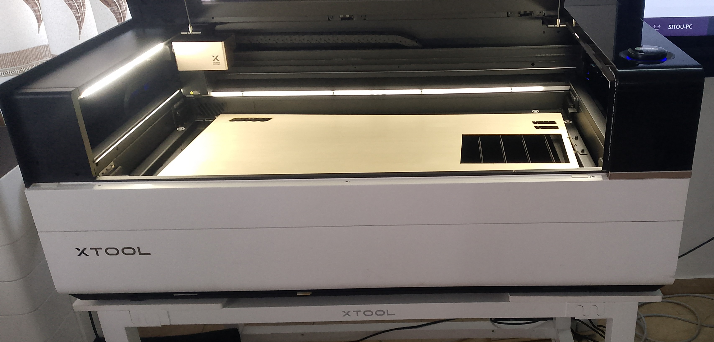
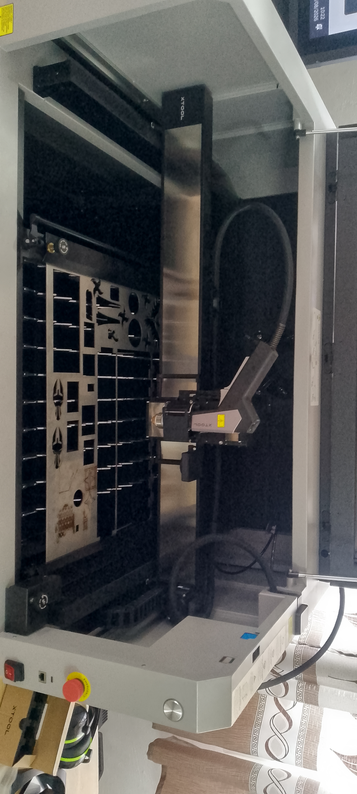
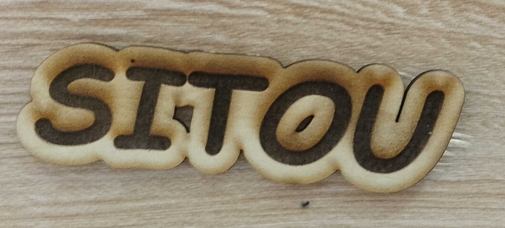
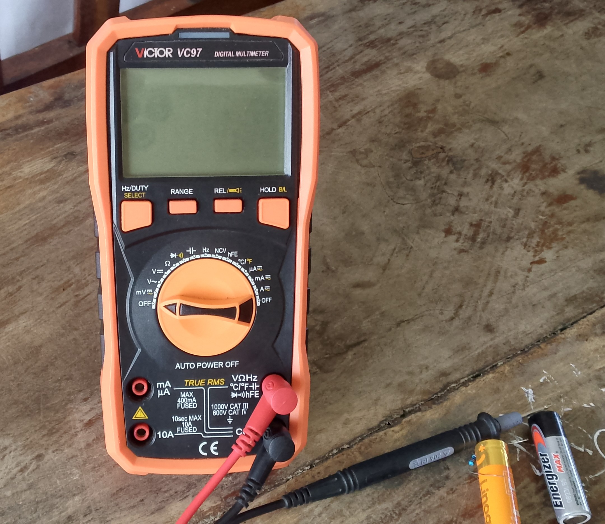
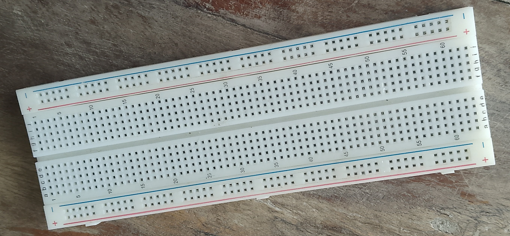
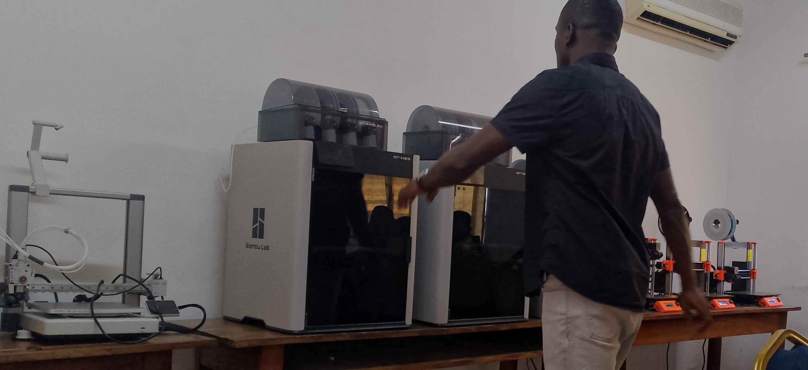
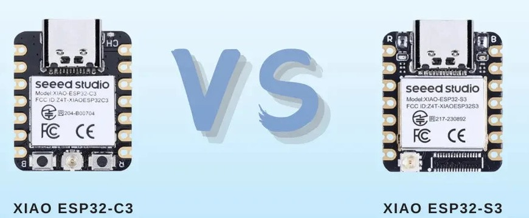

# JOURNAL — Mercrédi 26 août 2026 (Rédigé par : **AMOUZOU Kodjo**)

---

## Fait aujourd'hui

### 1. Base de découpe laser

- Présentation des modules de la journée
- Création des groupes de travail

**Salle 1**
- Présentation PowerPoint des machines de découpe laser
- Exemples de découpeuses par technologie :

| Technologie | Exemple de machine (Xtool) |
|-------------|------------------------------|
| CO2         | P3                           |
| Fibre       | MétalFab                     |
| Diode       | M1 Ultra                     |
| UV          | F2 Ultra                     |

- Présentation des découpeuses de la marque **Xtool** : F2 Ultra, P3, M1 Ultra (diode), MétalFab
- Anatomie des grandes familles de lasers industriels :

  | Type de laser | Milieu actif | Matériaux découpés |
  |----------------|--------------|----------------------|
  | CO2            | Gaz          | Non-métaux |
  | Fibre          | Solide       | Métaux |
  | Diode          | Semi-conducteur | Matériaux légers / gravure |

- Le laser CO2 est composé d'un mélange gazeux de **CO2 + N2 + He** (dioxyde de carbone, azote, hélium)

#### Comparatif des machines Xtool étudiées

| Machine | Type de laser | Puissance | Usage principal | 
|---|---|---|---|
| **P3** | CO2 | 80W | Bois, acrylique (toutes couleurs, y compris transparent), cuir, verre, gravure/découpe grande production | 
| **MétalFab** | Fibre | 1200W | Fabrication métallique lourde : découpe, gravure, soudure, décapage rouille/peinture | 
| **M1 Ultra** | Diode | 20W | Bois, acrylique foncé, cuir, papier, verre revêtu — usage polyvalent / bijouterie, petites séries | 
| **F2 Ultra** | Fibre (MOPA) | 60W | Gravure profonde + découpe métaux fins, marquage couleur haute vitesse sur inox/titane |  

#### Familles de lasers industriels — détail

| Famille | Milieu actif | Matériaux cibles | Points forts | Limites |
|---|---|---|---|---|
| **CO2** | Gaz (CO2 + N2 + He) | Non-métaux : bois, acrylique, cuir, tissu, verre (gravure surface) | Découpe nette, rapide sur bois/acrylique épais | Ne coupe pas le métal brut |
| **Fibre / MOPA** | Solide (fibre dopée) | Métaux : acier, inox, laiton, aluminium, titane | Gravure/découpe métal, marquage couleur, forte puissance | Coût plus élevé, peu adapté au bois/acrylique clair |
| **Diode** | Semi-conducteur | Bois, acrylique foncé, cuir, papier, verre revêtu | Compact, portable, économique | Moins puissant, découpe plus lente, marque bords noircis |
| **UV** | Semi-conducteur (lumière UV concentrée) | Verre (gravure 3D interne), matériaux délicats, surfaces sensibles à la chaleur | Bords nets sans brûlure, gravure fine multi-surfaces | Usage plus spécialisé/niche |

#### Matériaux découpables par famille de laser

| Matériau | CO2 | Fibre / MOPA | Diode | UV |
|---|---|---|---|---|
| Bois | Oui | Non | Oui | Non |
| Acrylique transparent | Oui | Non | Non | Limité |
| Acrylique foncé | Oui | Non | Oui | Limité |
| Cuir | Oui | Non | Oui | Non |
| Papier / carton | Oui | Non | Oui | Non |
| Tissu | Oui | Non | Oui | Non |
| Verre | Gravure surface | Non | Verre revêtu | Gravure interne 3D |
| Métaux (acier, inox, alu, laiton, titane) | Non | Oui | Non | Non |

*Légende : « Non » = matériau non découpable avec cette technologie ; « Limité » = compatible sous condition (matériau ou finition spécifique).*

- Installation du logiciel **Xtool** (Xtool Studio / Xtool Creative Space)
- Confection et impression d'une pièce test avec la découpeuse laser **P3**
- Moment de la découpeuse de la pièce test aves la découpeuse laser **P3**
- Image de la découpeuse F3

--------------

- Image du métalFab

--------------

- Rendu du découpe de la pièce d'éssai 

----------------

 **Salle 2**
### 2. Les bases de l'électronique dans les FabLabs

- Maîtriser les mesures électriques de base
- Grandeurs de base :
  - **Tension (V)** : la force qui pousse les électrons
  - **Courant (I)** : le débit — déplacement des électrons qui circulent
  - **Résistance (R)** : ce qui freine / s'oppose au passage du courant
- **Le condensateur** : composant qui stocke l'énergie de façon temporaire
- **Le multimètre** : outil de mesure polyvalent (tension, courant, résistance, continuité, capacité)

-----------------

-----------
- Mesure de la tension en **Volt (V)**
- Fonctions du multimètre :
  - **Hold** : enregistrer/figer une mesure affichée
  - **Range** : sélection de l'intervalle (calibre) de mesure
- Règle fondamentale de mesure :
  - la **tension** se mesure toujours **en dérivation** (en parallèle) sur le composant
  - l'**intensité (courant)** se mesure toujours **en série** dans le circuit
  - Présentation de la **plaquette breadboard** (plaque d'essai sans soudure) : outil de prototypage permettant de monter et tester des circuits électroniques sans soudure, grâce à des rangées de connexions internes
  - **Rails d'alimentation** (bandes rouge/bleu sur les bords) : rangées horizontales connectées sur toute leur longueur, utilisées pour distribuer le + et le − (VCC / GND) à tout le circuit
  - **Rangées centrales** (zone principale) : colonnes verticales de 5 trous connectés entre eux, séparées par une rainure centrale — chaque colonne forme un même nœud électrique
  - La rainure centrale sépare la plaquette en deux moitiés indépendantes, permettant d'y placer des composants type circuit intégré (DIP) à cheval sans les court-circuiter

------------------

- Image de Breadboard 

----------------------
---

### Visite officielle

- Visite du chef de bureau des Nations Unies
- **Motif :** échange sur la formation des FabLabs et encouragement des participants

### 3. Impression 3D FDM
 
- Séance en salle 3
- Principes généraux de l'impression 3D FDM 
- Présentation des outils d'impression 3D

------------

------------
- La présentation du plan de travail

#### Introduction à la fabrication additive
- La fabrication additive consiste à construire un objet **couche par couche**, par ajout de matière — à l'opposé de la fabrication soustractive (usinage, découpe) qui retire de la matière
- Regroupe plusieurs familles de procédés (FDM, SLA, SLS...) selon le matériau et la méthode de dépôt/solidification
#### Historique de l'impression 3D
- Années 1980 : premiers brevets (stéréolithographie / SLA par Chuck Hull, 1984)
- Années 1990-2000 : développement des technologies FDM, SLS pour l'industrie
- Années 2000-2010 : démocratisation grâce aux projets open-source (RepRap) et à l'expiration de brevets clés, essor du grand public et des FabLabs
#### Les grandes familles de technologies
- **FDM** (dépôt de fil fondu) : filament plastique fondu et extrudé
- **SLA/DLP** (résine) : résine liquide photosensible durcie par UV/laser
- **SLS** (fusion sur lit de poudre) : poudre (plastique/métal) fusionnée par laser
#### Tableau comparatif des technologies
 
| Technologie | Matière | Précision | Coût | Usage typique |
|---|---|---|---|---|
| FDM | Filament plastique | Moyenne | Faible | Prototypage, pièces fonctionnelles |
| SLA/DLP | Résine liquide | Élevée | Moyen | Détails fins, maquettes, bijouterie |
| SLS | Poudre | Élevée | Élevé | Pièces complexes sans support, petites séries industrielles |
 
#### Comprendre le FDM
- FDM = *Fused Deposition Modeling* (dépôt de fil fondu)
- Principe : un filament thermoplastique est chauffé jusqu'à fusion puis extrudé couche par couche à travers une buse pour construire l'objet du bas vers le haut
#### Mouvement de l'imprimante
- Déplacement sur 3 axes : **X** (gauche-droite), **Y** (avant-arrière), **Z** (hauteur, couche par couche)
- Selon les architectures de machine, c'est soit la buse, soit le plateau (ou une combinaison des deux) qui se déplace
#### Les filaments utilisés en FDM
- **PLA** : acide polylactique, biodégradable, facile à imprimer, basse température
- **ABS** : plus résistant mécaniquement et thermiquement, mais plus difficile à imprimer (rétractation, besoin d'enceinte fermée)
- **PETG** : bon compromis résistance/facilité, résistant à l'humidité
- Autres : TPU (flexible), Nylon, filaments composites (bois, carbone...)
#### Choisir son filament
- Critères : usage final de la pièce (esthétique, fonctionnelle, mécanique), résistance requise, exposition (chaleur, UV, humidité), niveau de difficulté d'impression, budget
#### Modélisation 3D
- Étape de conception numérique de l'objet avant impression, à l'aide d'un logiciel de CAO (Conception Assistée par Ordinateur)
- Le modèle est ensuite exporté en fichier **.STL** ou **.OBJ** pour être traité par la trancheuse
#### Focus Autodesk Fusion
- Logiciel de CAO paramétrique utilisé pour la modélisation 3D de pièces mécaniques et fonctionnelles

#### Du modèle 3D au G-code
- Le modèle 3D (.STL) est importé dans un logiciel **trancheur (slicer)**
- La trancheuse découpe virtuellement le modèle en couches horizontales et génère le **G-code** : liste d'instructions machine (déplacements, températures, vitesses) exécutée par l'imprimante
#### Paramètres essentiels d'impression
- **Hauteur de couche** : épaisseur de chaque couche déposée (précision vs vitesse)
- **Vitesse d'impression**
- **Température de la buse et du plateau** (selon le filament)
- **Remplissage (infill)** : pourcentage et motif de la structure interne

#### Supports & adhérence au plateau
- **Supports** : structures temporaires générées pour soutenir les parties en surplomb, retirées après impression
- **Adhérence au plateau** : solutions pour éviter le décollement pendant l'impression (plateau chauffant, laque, jupe/*brim*, radeau/*raft*)
#### Orientation de la pièce
- Le sens dans lequel la pièce est positionnée sur le plateau influence : la quantité de supports nécessaires, la résistance mécanique finale (selon l'axe des couches), et le rendu esthétique des surfaces

#### Première couche — sécurité — entretien
- La première couche est déterminante pour la réussite de l'impression : calibration du plateau, nivellement, propreté de la surface
- **Sécurité** : buse et plateau chauds (risques de brûlure), ventilation (émanations selon le filament), vigilance pendant les déplacements mécaniques
- **Entretien** : nettoyage régulier de la buse, vérification de la tension des courroies, lubrification des axes
#### Optimisation & étude de cas
- Ajustement des paramètres selon les retours d'expérience (essais/erreurs) pour améliorer qualité, temps et coût d'impression
- Étude de cas concrets pour illustrer les bons réglages selon le type de pièce
 
-----------------------

### 3. Initailisation au projet

- Salle 4
- Propositon des projets 
- Micro-contrôleurs XIAO ESP32-C3 et XIAO ESP32-S3

## Appris

- La conception assistée avec **Xtool Studio**
- Mise en forme et décalage  des tracés dans Xtool Studio
- Prise en main de l'utilisation de la **breadboard**
- Réglages du **multimètre** dans un circuit et prise de mesures (Tension ; Résistance)
- Comparaison des mesures prises avec le **code des couleurs** des résistances

- Connaissances des machines d'impression 3D

- Les technologies utilisées par ces technologies

---

## Raté, puis corrigé
- Mesure de la tension des piles -> Hypothèse : Mauvais branchement des fils de connexion -> Correction tentée : Changement des bornes  -> Resultat : Bonne mesure
------------------
- Mauvaise lecture des couleurs des bandes des résistances -> Hypothèse : Mauvaise disposition -> Correction tentée : Changement de position -> Résultat : Bonne lecture

---

## Décidé

- Prendre la photo du rendu de la découpe de la pièce test - SITOU 

---

## À faire demain

