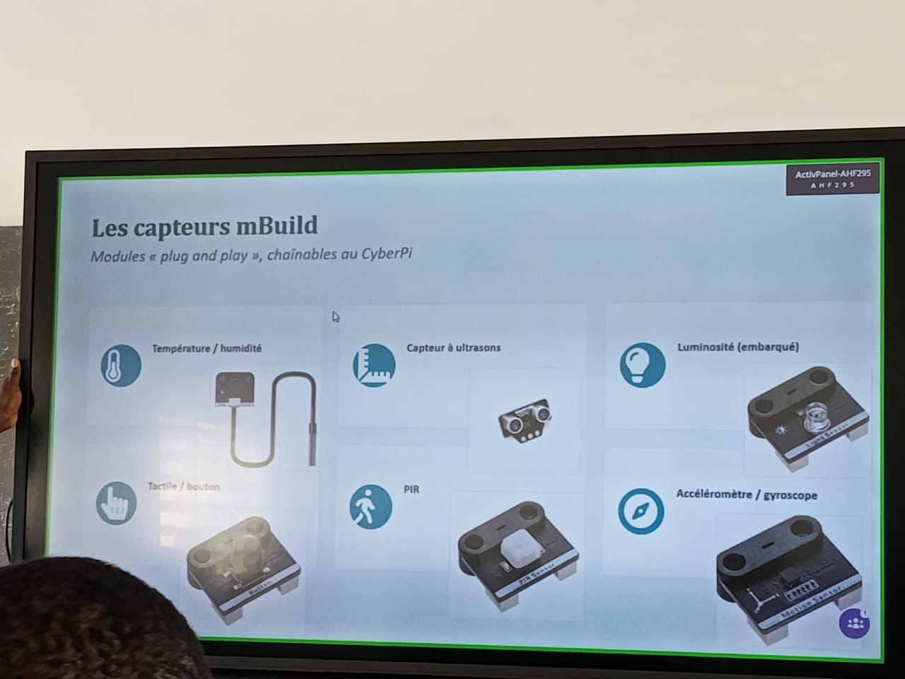

# JOURNAL — JEUDI 27 août 2026 Rédigé par : **AMOUZOU Kodjo** 

---

## Fait aujourd'hui

- Présence — Appel

### 1. Salle d'Électronique (CyberPi & écosystème mBuild)

**Notion d'entrée et de sortie**

| Entrée   | Cerveau           | Sortie      |
|----------|--------------------|-------------|
| Capteurs | Microcontrôleurs   | Actionneurs |

- Présentation du microcontrôleur CyberPi et du Pocket Shield

**La logique de base de tout objet « intelligent »**

| Capteur | Programme | Actionneur |
|---------|-----------|------------|
| Mesure  | Décide    | Agit       |

- Quelques exemples de capteurs : température/humidité, capteurs à ultrasons, luminosité (embarqué), tactile/bouton, PIR, accéléromètre/gyroscope, buzzer, ruban LED, etc.

- **Bouton** → capteur de pression
- **Capteur PIR** → variation de température
- **Capteur de mouvement** → direction

**Prise en main de mBlock**

- Installation de mBlock
- Familiarisation avec l'interface
- Mini-projet : connexion du PC au CyberPi — installation du code Python et visualisation
- Projet : veilleuse automatique

---

### 2. Salle 2 — Impression 3D

**Hauteur de couche**
0,08 mm ; 0,12 mm ; 0,16 mm ; 0,20 mm ; 0,28 mm

- Éviter le *warping* en utilisant le plateau chauffant
- Chaque filament a sa propre plage de température recommandée

**Vitesses d'impression**
- Faible : précision maximale
- Moyenne : bon équilibre
- Haute vitesse : gain de temps, mais risque de défauts

Autres paramètres : débit (*flow*), rétraction

**Motifs de remplissage**
Grid, Lines, Gyroid, etc.

**Parois (*walls*)**
- Nombre de parois : souvent 2 à 4
- Épaisseur totale = nombre de parois × largeur de ligne
- Plus de parois → meilleure résistance mécanique

**Couches supérieures/inférieures (Top/Bottom)**
- Ferment la pièce en haut et en bas

**Pratique**
- Installation du logiciel Bambu Studio
- Simulation et impression test d'un cube en 3D

<video width="80%" controls>
  <source src="../medias/video2.mp4" type="video/mp4">
</video>

---
### 3. Salle 3 — Insatallation du logiciel FUSION 360

- Installation de fusion 360
- Mise en pratique de la programmation en mBlock

### 4. Salle 4 — Découpe laser

- Revu des réglages basique de Xtool P3 après avoir reussi à se connecter à Xtool P3 
- Conception des cartes de visite **85mm x 55mm**
- Impression de la carte en suivant les instructions et les consignes du formateurs

## Appris

**Électronique**
- Découverte du CyberPi
- Les différentes formes de capteurs
- Utilisation et fonctionnement du CyberPi

**Impression 3D**
- Prise en main de Bambu Studio
- Réglages de base et premier test d'impression 3D

**Découpe laser Xtool P3**
- Maitrise des réglages basiques de xtool P3
- Gestion de l'environnement de travail sur le logiciel xtool
- Conception et préparation d'une pièce avec xtool

---

## Raté, puis corrigé

| Problème | Hypothèse | Correction tentée | Résultat |
|----------|-----------|--------------------|----------|
| Installation de mBlock lente | PC peu puissant | Utilisation de mBlock en ligne pour suivre la formation, puis installation en parallèle | Installation réussie par la suite |
| Ecrire un programme sur mBlock pour la variationdes couleurs de gauche alternée de 1 seconde de gauche à droite et vice versa | Manque de logique | Modification et prise de conscience | Programme écrit et reussi |

---

## Décidé

- L'installation de mBlock étant lente, décision de travailler avec la version cloud en ligne.

- Installation de Fusion 360 étant terminé, décision de travailler avec mBlock pour apprendre à programmer des petites choses

---

## À faire demain
- Préparer et imprimer ma propre pièce avec xtool - AMOUZOU
