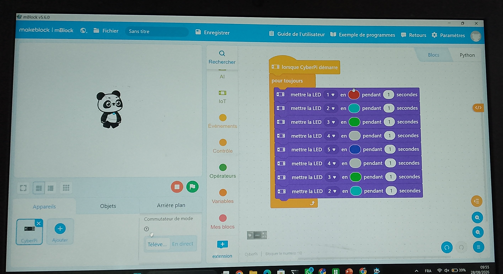
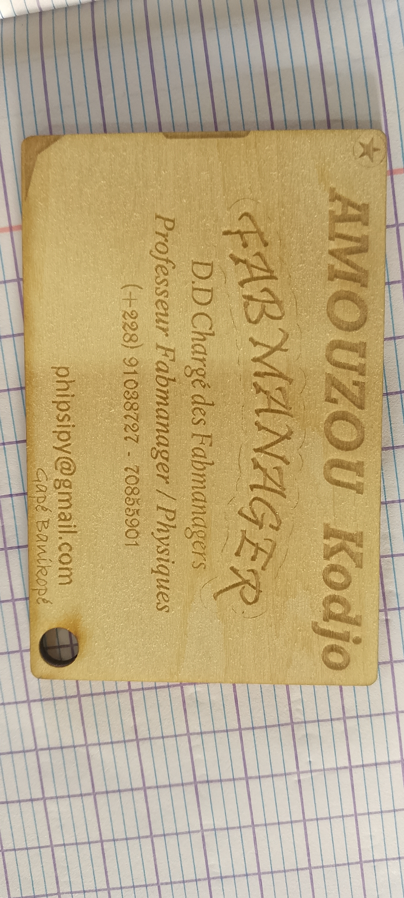
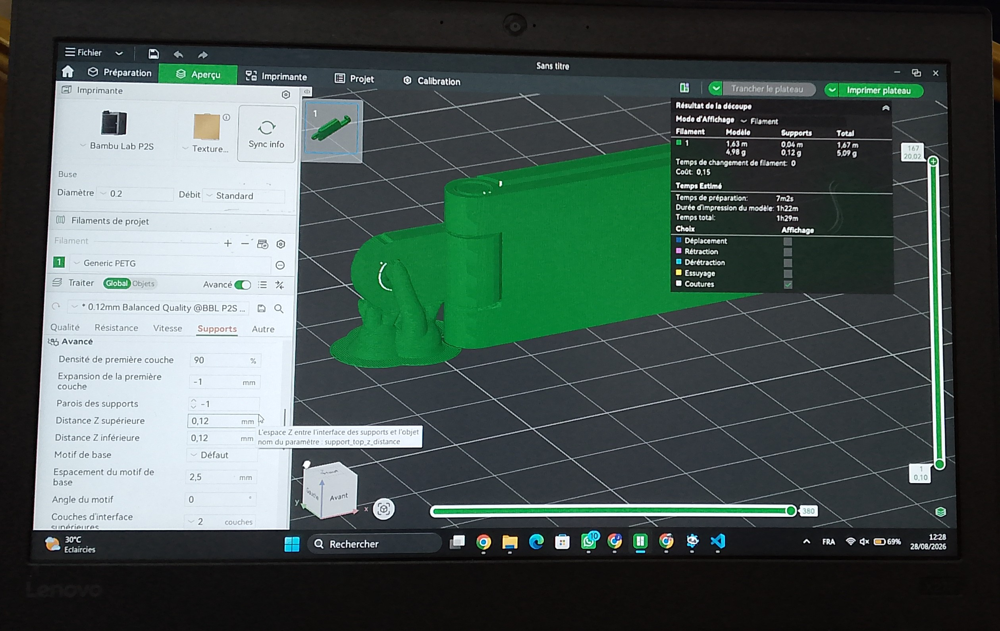

# JOURNAL — Vendredi 28 août 2026 Rédigé par : **AMOUZOU Kodjo**

---

## Fait aujourd'hui

- Présence — Appel

### 1. Salle d'Électronique

- Réalisation des projets :
  - Détecteur d'obscurité et de lumière avec mBlock
  - Réalisation du feu tricolore conditionnel

*Détecteur d'obscurité et de lumière — mBlock*

 
<video width="50%" controls>
  <source src="../medias/VID_20260828_101602.mp4" type="video/mp4">
</video>

*Vidéo — Détectieur d'obscurité et de lumière*
---

### 2. Salle Laser

- Présentation de l'écosystème
- Visualisation des impressions avec la xTool P3

*Découpe laser — xTool P3*

---

### 3. Salle de Projet

- Vérification de l'installation de Fusion 360
- Prise en main du programme
- Présentation du cahier des charges et du parcours des fichiers, avec le choix des projets

**Présentation des méthodes : Design Thinking et méthode en spirale**

Le **Design Thinking** est une méthode de conception centrée sur l'utilisateur : elle part des besoins réels des personnes concernées plutôt que d'une solution technique préconçue, pour construire des idées qui répondent réellement à un problème vécu.

Les 5 étapes du Design Thinking :

| Empathie | Définir | Idée | Prototyper | Tester |
|----------|---------|------|------------|--------|
| Recueillir la difficulté auprès de celui qui la vit | Formuler le problème en une phrase, sans solution | Produire beaucoup d'idées puis trancher selon des critères | Représenter l'idée au coût le plus bas | Observer un usage réel, se taire et noter |

Points clés :
- Ces étapes ne sont pas linéaires : elles sont itératives, on peut revenir en arrière à tout moment.
- L'étape « Définir » permet de poser clairement la problématique avant de chercher des solutions.
- L'étape « Idée » se déroule en deux temps : **divergence** (produire un maximum d'idées sans les juger) puis **convergence** (sélectionner et trancher selon des critères définis).
- Un prototype ne représente pas l'objet fini : il doit permettre de répondre à une seule question précise, au moindre coût.

Pièges classiques à éviter :
- Partir de la solution avant d'avoir bien posé le problème
- L'« empathie imaginaire » : supposer les besoins de l'utilisateur sans réellement les observer/écouter
- L'« idéation polie » : s'autocensurer et ne produire que des idées jugées « raisonnables », ce qui limite la créativité
- Le croquis qui devient plan figé trop tôt, avant d'avoir été réellement testé

**Méthode en spirale**

Contrairement au Design Thinking, la méthode en spirale est un modèle de gestion de projet (notamment utilisé en développement logiciel) qui combine approche itérative et gestion des risques : chaque tour de spirale reprend le projet à un niveau de détail et de maturité plus élevé.

Les 4 phases de chaque boucle :
1. Détermination des objectifs (et des alternatives possibles)
2. Identification et réduction des risques
3. Développement et test
4. Planification de l'itération suivante

> À retenir : le Design Thinking guide surtout la **définition et l'idéation** du besoin utilisateur, tandis que la méthode en spirale structure la **conduite du projet** dans le temps, une fois les idées retenues. Les deux approches sont complémentaires.

---

### 4. Salle d'Impression 3D

- Visualisation, réglages et programmation des machines d'impression 3D
- Reprise des réglages et impression d'une pièce

*Pièce test — impression 3D*

---

## Appris

- Programmer une machine d'impression 3D et lancer l'impression d'une pièce
- Concevoir un programme en électronique pour la détection d'obscurité et de lumière
- Les principes et étapes du Design Thinking, et les pièges à éviter dans une démarche centrée utilisateur
- Le fonctionnement en boucles de la méthode en spirale pour la gestion itérative de projet
- La complémentarité entre Design Thinking (idéation) et méthode en spirale (pilotage de projet)

---

## Raté, puis corrigé

| Problème | Hypothèse | Correction tentée | Résultat |
|----------|-----------|--------------------|----------|
| Dépôt des journaux à distance | Mauvaise manipulation | Utilisation de la ligne de commande pour le push | Push réussi, dépôt effectué avec succès sur GitHub |
| Exportation de la pièce pour l'impression 3D | Mauvaise manipulation (export du fichier tranché au lieu du fichier complet) | Réimport du fichier | Fichier correctement exporté, impression lancée |

---

## Décidé

- Utiliser la ligne de commande pour le dépôt à distance, l'option manuelle ayant échoué
- Changer de clé USB pour l'exportation du fichier 3D

---

## À faire demain

- Travailler sur la documentation
- Discuter des projets et faire le choix du projet à réaliser
- Présentation du cahier des charges

[Voir le journal du 27-08-2026](2026-08-27.md)