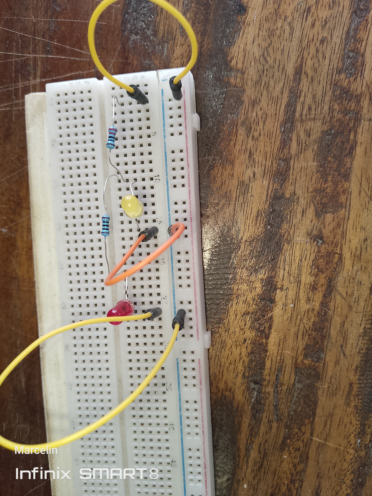
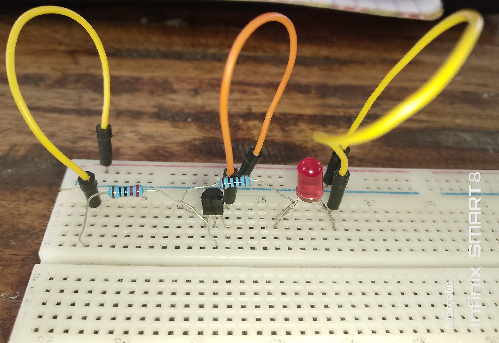

# JOURNAL — Mardi 1er septembre 2026 Rédigé par : **AMOUZOU Kodjo**

---

## 1. Fait aujourd'hui

### Présentation et poursuite des activités

- Participation à la présentation et aux activités prévues pour la journée.
- Poursuite de l'apprentissage et de la pratique de la **conception et de la modélisation 3D avec Fusion 360**.

### Conception 3D avec Fusion 360

Au cours de la séance de conception 3D, nous avons approfondi notre prise en main du logiciel **Fusion 360** à travers plusieurs exercices pratiques.

Nous avons notamment appris et pratiqué différentes méthodes et outils permettant de réaliser et de modifier des formes géométriques, notamment :

- la réalisation d'un **cylindre** de différentes manières ;
- la création d'un **cercle** ;
- l'utilisation de l'outil **Extrusion** ;
- l'utilisation et le réglage des **cotes d'esquisse** afin de définir précisément les dimensions d'une pièce.

Nous avons ensuite réalisé un exercice pratique consistant à concevoir un **porte-clés personnalisé**, comportant nos noms.

---

### Travaux pratiques en électronique

Nous avons également réalisé une séance pratique d'électronique sur **breadboard**.

Au total, nous avons réalisé **trois circuits électroniques**.

#### Circuit 1 : Générateur + LED + Résistance

Le premier circuit était constitué de :

- un générateur ;
- une LED ;
- une résistance.

Ce circuit a permis de mettre en pratique le fonctionnement d'un circuit électrique simple ainsi que le rôle de la résistance dans la limitation du courant traversant la LED.
---

#### Circuit 2 : Générateur + Deux LED + Deux Résistances

Le deuxième circuit était constitué de :

- un générateur ;
- deux LED ;
- deux résistances.

Cet exercice a permis de poursuivre la manipulation des composants électroniques et de mieux comprendre l'utilisation des résistances avec les LED.

### Photo du circuit 2

*Figure 3 — Circuit composé d'un générateur, de deux LED et de deux résistances.*

---

#### Circuit 3 : Générateur + Transistor + Résistance + LED

Le troisième circuit était constitué de :

- un générateur ;
- un transistor, notamment **2N2222 ou BC337** ;
- une résistance ;
- une LED.

Ce montage nous a permis d'aborder l'utilisation du **transistor comme composant électronique de commande** et d'observer son rôle dans le fonctionnement du circuit.

### Photo du circuit 3

*Figure 4 — Circuit composé d'un générateur, d'un transistor 2N2222 ou BC337, d'une résistance et d'une LED.*

---

### Découverte de l'impression textile DTF avec xTool

Nous avons également découvert le procédé de **personnalisation textile par impression DTF (Direct To Film)** à l'aide d'une solution **xTool**.

Au cours de cette séance, nous avons découvert les différentes étapes nécessaires à la réalisation d'une impression textile.

#### Étapes de l'impression DTF

Le processus étudié et mis en pratique comprend les étapes suivantes :

1. **Concevoir** : création ou préparation du visuel destiné à être imprimé sur le vêtement.
2. **Imprimer** : impression du visuel sur le film DTF à l'aide de l'imprimante DTF.
3. **Poudrer** : application de la poudre adhésive thermofusible sur la partie imprimée.
4. **Cuire** : passage du film dans l'équipement de cuisson afin de faire fondre et fixer correctement la poudre.
5. **Presser** : transfert du visuel sur le vêtement à l'aide d'une presse à chaud.
6. **Retirer** : retrait du film DTF après le transfert afin de laisser apparaître le motif imprimé sur le textile.

#### Matériels utilisés ou présentés

Les principaux matériels nécessaires à la réalisation d'une impression DTF sont :

- une **imprimante DTF xTool** ;
- du **film DTF** ;
- des **encres DTF** ;
- de la **poudre adhésive thermofusible** ;
- un équipement destiné au **poudrage et à la cuisson** ;
- une **presse à chaud** ;
- un **vêtement ou textile à personnaliser**.

#### Première réalisation pratique

Nous avons réalisé notre **toute première impression textile**.

Au cours de cette première expérience pratique, j'ai personnellement participé aux premières étapes du processus en réalisant :

- la **conception du visuel** ;
- la **préparation du fichier pour l'impression** ;
- l'**impression du visuel**.

Cette activité a permis de découvrir concrètement la chaîne complète de production d'une personnalisation textile et de comprendre comment une conception numérique peut être transformée en un motif imprimé sur un vêtement.

## 2. Appris

### En conception 3D

- Différentes méthodes de création de formes cylindriques dans Fusion 360.
- La création et l'utilisation d'un cercle dans une esquisse.
- Le principe et l'utilisation de l'outil **Extrusion**.
- L'importance des **cotes d'esquisse** pour contrôler précisément les dimensions d'une conception.
- Les premières étapes de conception d'un objet personnalisé.
- La réalisation d'un porte-clés comportant un texte ou un nom.

### En électronique

- La réalisation d'un circuit électronique simple sur breadboard.
- Le rôle d'une résistance dans un circuit comportant une LED.
- L'utilisation de plusieurs LED et résistances dans un même montage.
- Les bases du câblage d'un transistor.
- La découverte et la manipulation des transistors **2N2222** et **BC337**.
- Le rôle d'un transistor dans un circuit électronique de commande.

### En impression textile DTF

- Le principe général de l'impression **DTF (Direct To Film)**.
- Les différentes étapes de réalisation d'une impression textile : **concevoir, imprimer, poudrer, cuire, presser et retirer le film**.
- Le rôle du film DTF et des encres DTF.
- L'utilisation de la poudre adhésive thermofusible dans le processus de transfert.
- Le rôle de la cuisson dans la préparation du transfert.
- L'utilisation d'une presse à chaud pour transférer le motif sur un vêtement.
- Les bases de la préparation d'un visuel destiné à l'impression textile.
- La chaîne de transformation d'une conception numérique en un motif personnalisé sur un textile.

---

## 3. Raté, puis corrigé

| Problème rencontré | Hypothèse / Analyse | Correction apportée | Résultat |
|---|---|---|---|
| Prise en main des différents outils de Fusion 360 | Certains outils de conception nécessitaient encore une meilleure compréhension de leur fonctionnement | Réalisation progressive d'exercices pratiques sur le cercle, le cylindre, l'extrusion et les cotes d'esquisse | Meilleure maîtrise des premiers outils de conception 3D |
| Réalisation d'un objet personnalisé | La conception d'un porte-clés avec un nom nécessite de combiner plusieurs opérations de conception | Application des outils d'esquisse, de cotation et d'extrusion | Réalisation d'un premier modèle de porte-clés personnalisé |
| Câblage des circuits sur breadboard | Une attention particulière était nécessaire pour respecter les connexions et le sens des composants | Vérification progressive des connexions avant la mise sous tension | Réalisation et fonctionnement des différents circuits |
| Manipulation du transistor | Le rôle et le branchement des transistors 2N2222 et BC337 nécessitaient une première prise en main | Réalisation d'un circuit pratique avec générateur, transistor, résistance et LED | Première compréhension pratique de l'utilisation d'un transistor dans un circuit |
| Découverte du processus d'impression DTF | Le processus comporte plusieurs étapes successives nécessitant de comprendre l'ordre et le rôle de chaque opération | Observation du processus et participation pratique à la conception et à l'impression du premier visuel | Première compréhension pratique de la chaîne complète de personnalisation textile DTF |

---

## 4. Décision

- Continuer à approfondir la maîtrise de **Fusion 360** à travers la réalisation de nouvelles pièces et de nouveaux objets.
- Améliorer progressivement la précision des conceptions grâce à l'utilisation correcte des cotes d'esquisse.
- Poursuivre les travaux pratiques en électronique afin de mieux comprendre le rôle et le fonctionnement des différents composants.
- Renforcer la maîtrise du câblage sur breadboard avant la réalisation des circuits plus complexes du projet **P083**.
- Approfondir les connaissances sur le processus de **personnalisation textile par impression DTF**.
- Conserver et organiser les photos des réalisations pratiques afin de documenter l'évolution des apprentissages et du projet.

---

## 5. À faire demain

- Continuer les exercices de conception et de modélisation 3D avec Fusion 360.
- Approfondir l'utilisation des outils d'esquisse et de modélisation.
- Poursuivre les activités pratiques en électronique.
- Approfondir l'étude des composants électroniques utilisés dans les différents montages.
- Approfondir la compréhension du processus d'impression textile DTF.
- Continuer l'avancement du projet **P083** et de sa documentation.

---

## Bilan de la journée

Cette journée a été particulièrement enrichissante, car elle a permis de poursuivre l'apprentissage pratique dans **trois domaines importants : la conception 3D, l'électronique et la personnalisation textile**.

En conception 3D, nous avons approfondi notre utilisation de Fusion 360 en découvrant différentes méthodes de réalisation de formes géométriques et en utilisant des outils tels que le cercle, l'extrusion et les cotes d'esquisse. La réalisation d'un porte-clés personnalisé a permis de mettre directement en pratique les notions étudiées.

En électronique, la réalisation de trois circuits sur breadboard a permis de manipuler des composants essentiels tels que les LED, les résistances et les transistors. Ces exercices pratiques constituent une étape importante pour mieux comprendre les circuits électroniques qui seront utilisés dans la réalisation du projet **P083**.

Enfin, la découverte de l'impression textile DTF avec xTool a permis d'explorer une nouvelle technologie de fabrication et de personnalisation. La participation personnelle à la conception et à l'impression de notre première réalisation textile a permis de mieux comprendre le passage d'une conception numérique à un produit physique personnalisé.

La journée a donc permis d'associer efficacement **apprentissage théorique, manipulation pratique et réalisation concrète**, tout en développant des compétences complémentaires utiles dans les domaines de la conception, de l'électronique et de la fabrication numérique.

---

[Voir le journal précédent du 31-08-2026](2026-08-31.md)