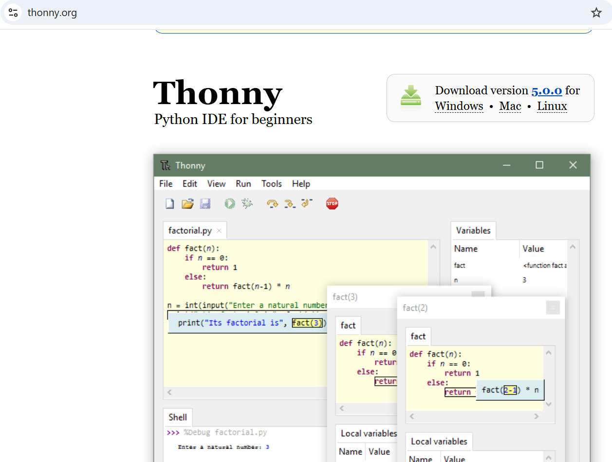
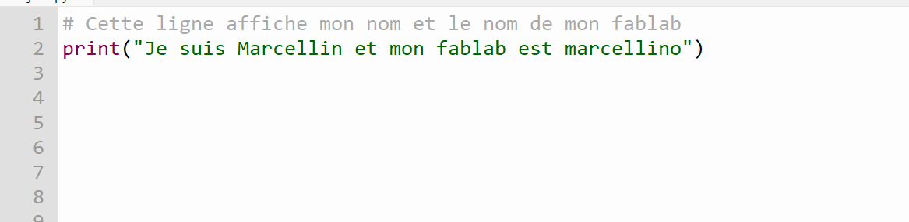
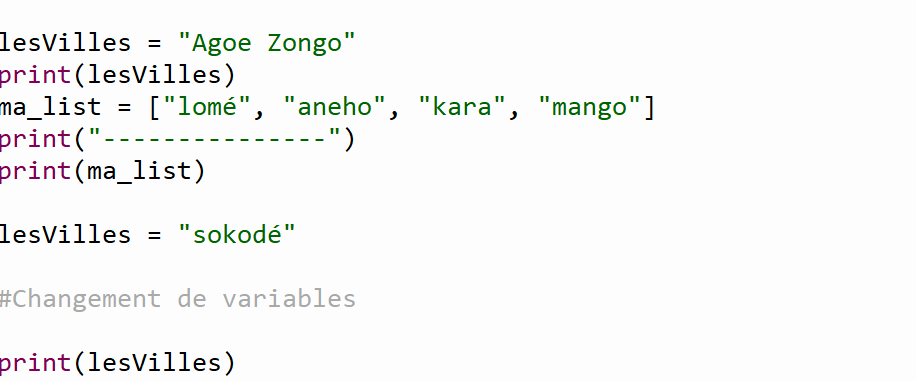
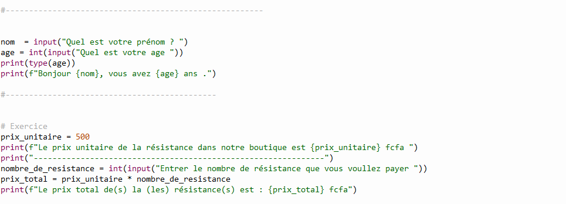

# JOURNAL — Jeudi 03 septembre 2026 Rédigé par : **AMOUZOU Kodjo**

---

## 1. Fait aujourd'hui

- Présence et appel.
- Travail en groupe 16 avec notre mentor sur le projet.
- Échange d'idées et analyse de différentes propositions pour améliorer le projet.
- Réalisation de nouvelles esquisses du projet.
- Modification de la liste de certains composants en fonction des besoins identifiés.


- Initiation au langage de programmation **Python**.
- Téléchargement et installation de **Python**.
- Découverte de l'environnement **IDLE** installé avec Python.
- Téléchargement et installation de **Thonny** comme environnement de développement pour Python.
- Prise en main de Thonny et découverte de son interface.
- Écriture et exécution du premier programme Python.
- Manipulation des variables et modification de leurs valeurs.
- Création et affichage d'une liste de villes.
- Utilisation de différents types de données.
- Conversion d'une chaîne de caractères en entier avec `int()`.
- Réalisation d'un calcul à partir de variables.
- Découverte de la concaténation des chaînes de caractères.
- Utilisation des **f-strings** pour insérer des variables dans une phrase.
- Réalisation de plusieurs exercices pratiques.

- Installation et utilisation de Python, IDLE ou Thonny.
  

- Premier programme avec python 
 
- Manipulation des variables et des listes.
 

- Conversion de type et calcul avec les variables.

- Exemple d'utilisation des f-strings.

---


## 2. Appris

- **Langage de programmation :** ensemble de règles et d'instructions permettant de communiquer avec un ordinateur et de lui faire exécuter des tâches.

- **Syntaxe :** ensemble des règles qui définissent la manière correcte d'écrire les instructions d'un langage de programmation.

- **Algorithme :** suite ordonnée d'instructions permettant de résoudre un problème ou de réaliser une tâche.

- **Pseudocode :** représentation simplifiée d'un algorithme permettant de décrire les différentes étapes d'une solution avant de l'écrire dans un langage de programmation.

- **Compilateur :** programme qui traduit le code source afin de le transformer dans une forme exécutable par la machine.

- **Interpréteur :** programme qui analyse et exécute les instructions d'un programme au fur et à mesure de son exécution.

- **Différence entre compilation et interprétation :**
  - La compilation traduit le programme avant son exécution.
  - L'interprétation permet d'analyser et d'exécuter les instructions pendant l'exécution.
  - Python utilise notamment un interpréteur pour exécuter les programmes.

- **Fonction `print()` :** utilisée pour afficher des informations dans la console.

- **Variable :** élément nommé qui permet de stocker une valeur dans un programme. Une variable peut être modifiée au cours de l'exécution.

- **Modification d'une variable :** une variable peut recevoir une nouvelle valeur sans qu'il soit nécessaire de créer une nouvelle variable.

- **Liste (`list`) :** structure permettant de regrouper plusieurs valeurs dans un même objet.

```python
ma_list = ["lomé", "aneho", "kara", "mango"]
```

- **Conversion de type :** possibilité de transformer une donnée d'un type vers un autre. Par exemple, une chaîne de caractères contenant un nombre peut être convertie en entier avec `int()`.

```python
duree_str = "3"
duree = int(duree_str)
```

- **Calcul avec des variables :** les variables peuvent être utilisées dans des opérations mathématiques.

```python
prix = 4.5
total = duree * prix

print("Total :", total, "euros")
```

- **Concaténation :** opération qui consiste à assembler plusieurs chaînes de caractères afin de former une seule chaîne.

- **F-string :** méthode permettant d'intégrer directement des variables dans une chaîne de caractères.

```python
Nom = "AMOUZOU"
age = "56"

print(f"Mon nom c'est {Nom}, j'ai {age} ans")
```

- **Types de données étudiés en Python :**
  - `int` : nombres entiers.
  - `str` : chaînes de caractères.
  - `float` : nombres décimaux.
  - `bool` : valeurs booléennes, `True` ou `False`.
  - `list` : liste ordonnée et modifiable de valeurs.
  - `tuple` : collection ordonnée de valeurs non modifiable.
  - `dict` : données organisées sous forme de paires clé-valeur.


---

## 3. Raté, puis corrigé

| Problème rencontré | Hypothèse / Analyse | Correction apportée | Résultat |
|---|---|---|---|
| Certaines idées du projet nécessitaient des améliorations | Analyse des besoins et échanges avec le mentor | Modification des esquisses et de certains composants | Projet mieux défini |
| Difficultés lors de la première prise en main de Python | Première découverte du langage et de son environnement | Explications et exercices pratiques | Meilleure compréhension des bases de Python |

---

## 4. Décision

- Poursuivre l'amélioration du projet en groupe.
- Prendre en compte les remarques et conseils du mentor.
- Approfondir progressivement les bases du langage Python.
- Mettre en pratique les notions apprises à travers des exercices.

---

## 5. À faire demain

- Continuer le travail sur le projet du groupe 16.
- Poursuivre l'apprentissage du langage Python.
- Réaliser des exercices pratiques sur les variables et les types de données.
- Approfondir les notions abordées aujourd'hui.

---

[Voir le journal précédent du 02-09-2026](2026-09-02.md)


