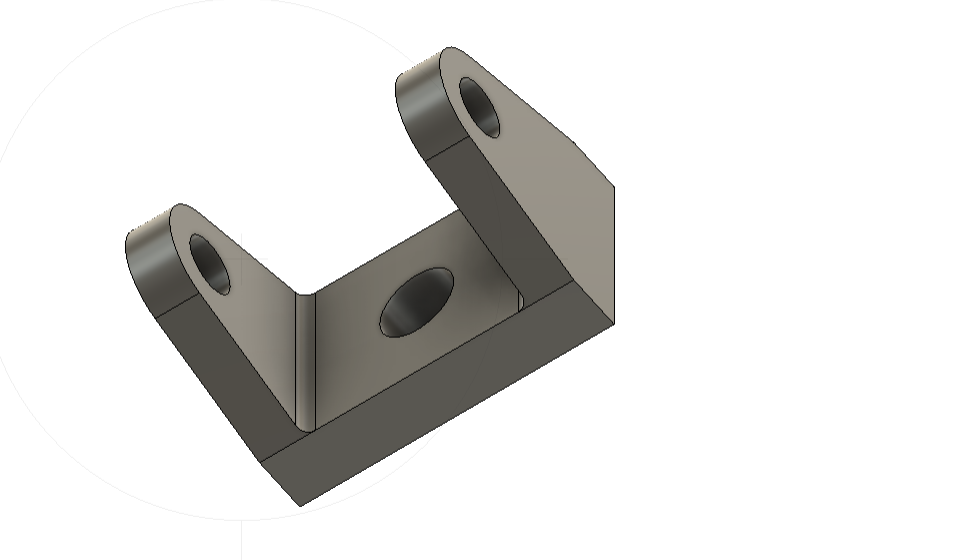
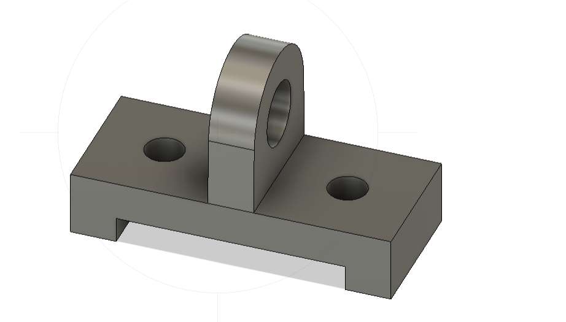

# JOURNAL — Vendredi 4 septembre 2026 - Rédigé par : **AMOUZOU Kodjo**

---

## Fait aujourd'hui

### 1. Présence et appel

- Présence des participants et appel.
- Organisation du groupe avant le début des activités.

---

### 2. Impression 3D

- Séance dans la salle d'impression 3D.
- Réalisation d'exercices pratiques assistés par un mentor.

- Réalisation d'un exercice de manière autonome.
- Mise en pratique des notions vues précédemment sur la conception et l'impression 3D.

---

### 3. Fabrication des PCB par découpe laser

- Séance dans la salle de découpe laser consacrée à la fabrication des **PCB (Printed Circuit Board)**.

#### Pourquoi fabriquer un PCB ?

- Un PCB permet de réaliser un circuit électronique de manière organisée et durable.
- Il permet de remplacer un montage réalisé uniquement sur breadboard par une carte plus compacte et adaptée à une utilisation permanente.
- Les composants électroniques peuvent être fixés et reliés par des pistes conductrices.

#### De quoi est constitué un PCB ?

Un PCB est principalement constitué :

- d'un support isolant ;
- d'une couche ou de pistes conductrices, généralement en cuivre ;
- de zones permettant la fixation et la connexion des composants électroniques.

#### Principales méthodes de fabrication étudiées

##### 1. Méthode au perchlorure de fer

Les principales étapes sont :

- utilisation d'une plaque cuivrée ;
- transfert du circuit sur la plaque ;
- attaque chimique du cuivre avec le perchlorure de fer ;
- rinçage et nettoyage de la plaque.

Le perchlorure de fer permet de retirer le cuivre qui ne doit pas rester sur la plaque afin de former les pistes du circuit.

##### 2. Méthode du papier glacé et du fer à repasser
  
Les étapes sont :

- impression du circuit sur du papier glacé ;
- transfert thermique du circuit sur la plaque cuivrée à l'aide d'un fer à repasser ;
- gravure au perchlorure de fer ;
- nettoyage de la plaque.

Cette méthode permet de transférer le dessin du circuit avant l'étape de gravure chimique.

##### 3. Fabrication numérique

La fabrication numérique repose sur :

- la conception du circuit électronique avec un logiciel ;
- la génération des fichiers nécessaires à la fabrication ;
- l'utilisation d'une machine de fabrication numérique pour réaliser automatiquement les pistes.

Cette méthode permet notamment d'automatiser la fabrication et d'obtenir des résultats plus réguliers.

---

### 4. Du schéma électronique au PCB

- Étude du passage du **schéma électronique** vers la conception d'un PCB.
- Présentation de plusieurs logiciels utilisés pour concevoir les circuits imprimés :
  - **KiCad**
  - **Proteus**
  - **EasyEDA**
  - **Autodesk Fusion**

- Le schéma électronique sert de base à la conception du circuit imprimé.
- Après la conception, les fichiers nécessaires à la fabrication peuvent être générés puis utilisés par une machine adaptée.

---

### 5. Utilisation de la xTool F2 Ultra pour la fabrication des circuits

- Étude de l'utilisation de la **xTool F2 Ultra** pour la fabrication numérique des circuits.

#### Pourquoi utiliser la xTool F2 Ultra ?

- Gravure et traitement précis du matériau.
- Automatisation du processus de fabrication.
- Réduction des interventions manuelles continues.
- Répétabilité : chaque plaque peut être fabriquée avec les mêmes réglages.
- Réduction des manipulations manuelles.
- Bonne adaptation au prototypage rapide.

#### Réglages étudiés

- Format d'exportation des fichiers : **PDF ou SVG**.
- Le choix du format permet de préparer le dessin du circuit pour son utilisation dans le processus de fabrication numérique.

---

### 6. Programmation Python

- Poursuite de l'apprentissage de la programmation en **Python**.
- Étude des structures de contrôle avec des exemples pratiques :
  - `if`
  - `elif`
  - `else`
  - `for`
  - `while`

- Manipulation des principales structures de données :
  - listes ;
  - tuples ;
  - dictionnaires.

- Étude des affectations et des opérations.
- Réalisation de plusieurs exercices pour mettre en pratique les notions étudiées.

---

## Appris

- Comprendre l'intérêt d'un **PCB** dans la réalisation d'un circuit électronique.
- Identifier les principaux éléments constituant un PCB.
- Comprendre les principales méthodes de fabrication d'une carte électronique.
- Comprendre les étapes générales allant du schéma électronique à la fabrication du PCB.
- Découvrir différents logiciels de conception de circuits imprimés.
- Comprendre l'intérêt de la fabrication numérique avec la **xTool F2 Ultra**.
- Approfondir l'utilisation des structures de contrôle en Python.
- Manipuler les listes, tuples et dictionnaires.
- Utiliser les affectations et les opérations dans des programmes Python.

---

## Raté, puis corrigé

| Difficulté rencontrée | Cause / hypothèse | Correction apportée | Résultat |
|---|---|---|---|
| Erreurs dans certains exercices Python | Mauvaise compréhension ou mauvaise utilisation des structures de contrôle et des structures de données | Relecture du code, explications du mentor et reprise des exercices | Exercices corrigés et meilleure compréhension des notions |
| Difficultés lors des exercices d'impression 3D | Besoin de mieux maîtriser les étapes pratiques et les réglages | Accompagnement du mentor et reprise des exercices | Meilleure prise en main du processus d'impression 3D |
| Difficultés dans la préparation de la fabrication du PCB | Nécessité de comprendre les différentes étapes entre la conception et la fabrication | Explication des étapes et observation du processus de fabrication numérique | Meilleure compréhension de la fabrication d'un PCB |

---

## Décidé

- Continuer à pratiquer la conception et la fabrication de PCB.
- Approfondir l'utilisation des logiciels de conception électronique.
- Continuer les exercices de programmation Python afin de mieux maîtriser les structures de contrôle et les structures de données.

---

## À faire demain

- Poursuivre les activités pratiques de fabrication numérique.
- Continuer la programmation Python avec de nouveaux exercices.
- Approfondir les notions liées à la conception et à la fabrication des PCB.
