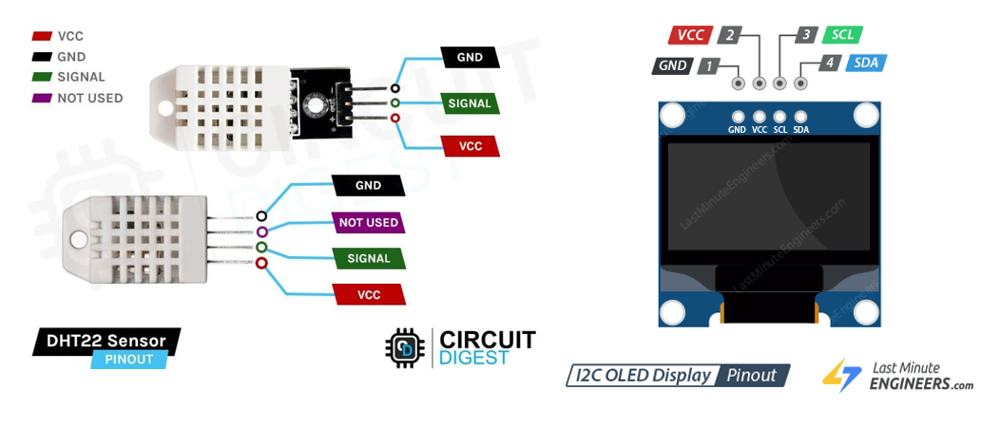
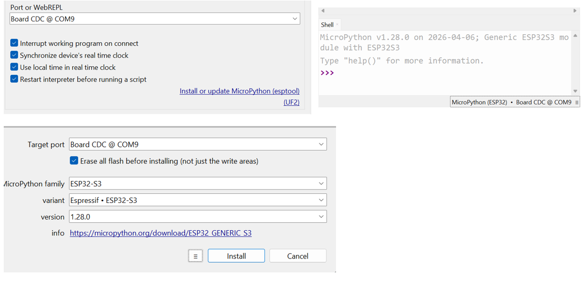

# JOURNAL — Samedi 5 septembre 2026 Rédigé par : **AMOUZOU Kodjo**

---

## Fait aujourd'hui

### 1. Présence et appel

- Présence des participants et appel.
- Organisation du groupe avant le début des activités.

---

### 2. TP — Station météo connectée

- Réalisation d'un TP sur la conception d'une **station météo connectée**.
- Découverte de la carte **XIAO ESP32S3** de Seeed Studio.
- Présentation de ses caractéristiques et de son utilisation avec **MicroPython**.
- Comparaison entre une carte ESP32 générique et la XIAO ESP32S3.
- Image de XIAO ESP32S3 et DHT22

---

### 3. Utilisation du capteur DHT22

- Découverte du **capteur DHT22**.
- Utilisation du capteur pour mesurer :
  - la température ;
  - l'humidité.
- Compréhension du principe de récupération des mesures à partir du capteur.

---

### 4. Utilisation de l'écran OLED

- Découverte de l'écran **OLED 0.96" SSD1306**.
- Utilisation de la communication **I²C** pour connecter l'écran à la carte.
- Affichage des valeurs de température et d'humidité sur l'écran.

- Image de OLED 

---

### 5. Câblage du système

- Réalisation du câblage entre la **XIAO ESP32S3**, le **DHT22** et l'écran OLED.
- Utilisation d'une alimentation en **3,3 V**.
- Connexion du DHT22 sur la broche **D3 (GPIO4)**.
- Connexion de l'écran OLED :
  - SDA sur **D4 (GPIO5)** ;
  - SCL sur **D5 (GPIO6)**.
- Vérification des différentes connexions avant la mise en fonctionnement.

---

### 6. Installation et configuration de Thonny

- Installation et utilisation de **Thonny IDE**.
- Connexion de la XIAO ESP32S3 à l'ordinateur avec un câble USB-C.
- Configuration de Thonny pour utiliser **MicroPython (ESP32)**.
- Installation du firmware **MicroPython** sur la carte.
- Sélection et configuration du port série de la carte.
- Vérification de la communication entre la carte et Thonny.

---

### 7. Installation des bibliothèques

- Utilisation du gestionnaire de paquets de Thonny.
- Installation de la bibliothèque **ssd1306** pour contrôler l'écran OLED.
- Utilisation de la bibliothèque intégrée `dht` pour communiquer avec le DHT22.

---

### 8. Programmation en MicroPython

- Écriture d'un premier programme pour la station météo.
- Utilisation des bibliothèques :
  - `machine`
  - `ssd1306`
  - `dht`
  - `time`
- Lecture de la température et de l'humidité.
- Affichage des mesures sur l'écran OLED.
- Actualisation automatique des valeurs toutes les **2 secondes**.
- Exécution et test du programme dans Thonny.

---

## Appris

- Comprendre le rôle d'une carte **XIAO ESP32S3**.
- Découvrir la programmation d'une carte ESP32 avec **MicroPython**.
- Utiliser **Thonny IDE** pour programmer une carte électronique.
- Installer un firmware MicroPython.
- Utiliser un **capteur DHT22** pour mesurer la température et l'humidité.
- Utiliser un écran **OLED SSD1306**.
- Comprendre l'utilisation de la communication **I²C**.
- Réaliser correctement le câblage d'un système fonctionnant en **3,3 V**.
- Installer une bibliothèque MicroPython avec Thonny.
- Écrire un programme permettant de lire et d'afficher des mesures.

---

## Raté, puis corrigé

| Difficulté rencontrée | Cause / hypothèse | Correction apportée | Résultat |
|---|---|---|---|
| Difficultés lors de la configuration de la carte | Mauvaise configuration de l'interpréteur ou du port | Reconfiguration de Thonny et vérification du port série | Carte reconnue et prête à être programmée |
| Difficultés lors de l'installation de la bibliothèque OLED | Bibliothèque nécessaire non intégrée au firmware | Installation de `ssd1306` avec le gestionnaire de paquets de Thonny | Bibliothèque installée correctement |
| Difficultés lors du câblage | Mauvaise identification de certaines broches | Vérification du schéma de câblage et correction des connexions | DHT22 et OLED correctement connectés |
| Erreurs lors de l'exécution du programme | Erreurs dans le code ou dans les connexions | Vérification du programme et du câblage | Programme exécuté correctement et mesures affichées |

---

## Décidé

- Continuer à pratiquer la programmation des cartes ESP32 avec MicroPython.
- Approfondir l'utilisation des capteurs électroniques.
- Continuer à utiliser les écrans OLED avec la communication I²C.
- Réaliser d'autres projets pratiques avec la XIAO ESP32S3.
- Améliorer la maîtrise de Thonny et du développement en MicroPython.

---

## À faire demain

- Poursuivre les activités pratiques.
- Continuer les exercices de programmation.
- Approfondir l'utilisation des cartes ESP32.
- Mettre en pratique les notions apprises dans de nouveaux projets.