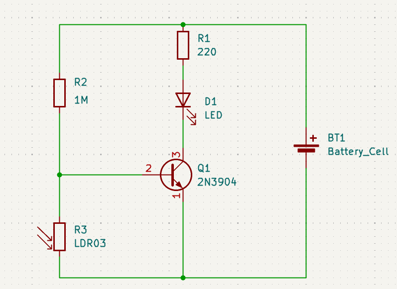
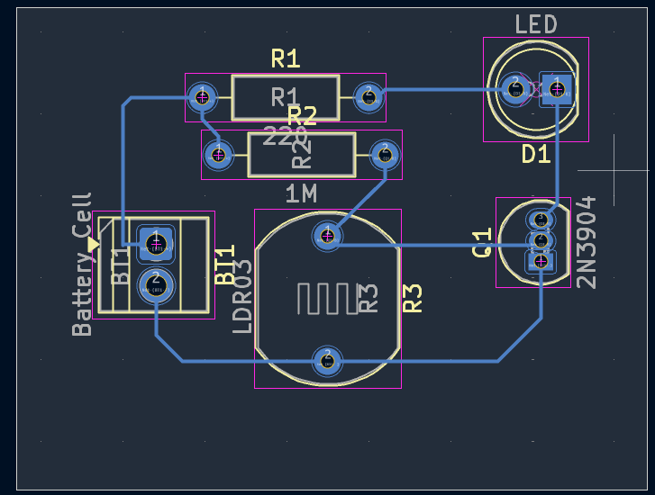

# JOURNAL — Samedi 5 septembre 2026

**Rédigé par : AMOUZOU Kodjo**

---

## Fait aujourd'hui

- Présence et appel.
- Cours d'initiation aux PCB.
- Définition de PCB : **Printed Circuit Board**, ou **circuit imprimé**.
- Le PCB sert à supporter, connecter et organiser les composants électroniques.
- Les connexions électroniques sont réalisées grâce aux pistes en cuivre.

### À retenir : Breadboard

- Le **Breadboard** sert principalement à expérimenter et à tester des circuits électroniques avant leur réalisation définitive sur un PCB.

### Rôles et limites du Breadboard

- Câblage volumineux et parfois fragile.
- Connexions moins fiables.
- Sensibilité aux vibrations.
- Circuit difficile à reproduire à l'identique.

### Avantages du PCB

- Réduction de la taille et du câblage.
- Connexions solides et répétables.
- Meilleure résistance aux vibrations.
- Possibilité de fabriquer plusieurs exemplaires du même circuit.

### Anatomie d'un PCB

Les principales parties étudiées sont :

- **Substrat** : support isolant de la carte.
- **Cuivre** : permet de réaliser les pistes conductrices.
- **Solder Mask** : couche de protection qui recouvre le cuivre.
- **Silkscreen** : couche contenant les indications et inscriptions sur la carte.
- **Pads** : surfaces conductrices permettant de souder les composants.
- **Vias** : trous métallisés permettant de relier différentes couches du PCB.
- **Mounting Holes** : trous permettant de fixer la carte.

---

### De l'idée au schéma

Avant de réaliser un PCB, il faut :

- Définir clairement ce que le circuit doit faire.
- Choisir les composants adaptés.
- Réaliser le schéma électronique avant de dessiner la carte.
- Associer chaque composant à son **footprint**.
- Définir les contraintes :
  - Alimentation.
  - Dimensions.
  - Courant.
  - Connexions.
  - Environnement d'utilisation.

---

### Réalisation d'un PCB

- Réalisation d'un PCB pour un circuit comportant :
  - Une LED.
  - Deux résistances.
  - Une photorésistance (**LDR**).
  - Un transistor.
- Le circuit réalisé permet de détecter l'obscurité ou les variations de lumière.
- Prise en main du logiciel **KiCad** et apprentissage des différentes manipulations nécessaires jusqu'à la réalisation du circuit.

---

## Appris

- Compréhension du rôle et de l'utilité d'un PCB.
- Différence entre un **Breadboard** et un **PCB**.
- Identification des principales parties constituant un PCB.
- Étapes nécessaires pour passer d'une idée à un circuit imprimé.
- Importance du choix des composants et de leurs footprints.
- Découverte du logiciel **KiCad** pour la conception de circuits imprimés.
- Réalisation d'un circuit de détection d'obscurité utilisant une LED, deux résistances, une LDR et un transistor.

---

## Raté, puis corrigé

| Difficulté rencontrée | Cause / hypothèse | Correction apportée | Résultat |
|---|---|---|---|
| KiCad ne s'ouvrait pas après l'installation | Le logiciel ne se lançait pas correctement après l'installation | Réinstallation de KiCad à trois reprises, puis redémarrage du PC | KiCad a finalement fonctionné correctement |
| Difficultés lors de la conception du PCB | Prise en main du logiciel KiCad | Manipulation et accompagnement du mentor | Meilleure maîtrise du logiciel |
---

## Décidé

- Continuer à pratiquer la conception de PCB avec KiCad.
- Améliorer la maîtrise du placement et du routage des composants.
- Vérifier systématiquement le schéma électronique avant la fabrication du PCB.

---

## À faire demain

- Poursuivre la conception et la réalisation des circuits électroniques.
- Continuer la pratique sur KiCad.
- Approfondir les notions de conception et de fabrication des PCB.
- Avancer sur le projet de groupe.