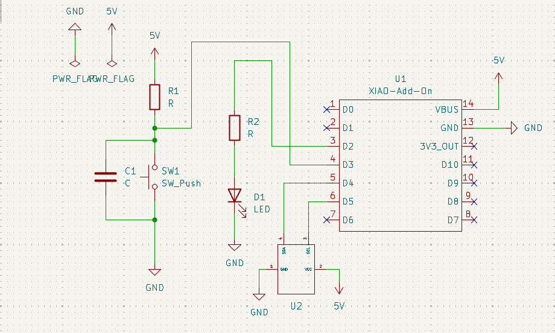
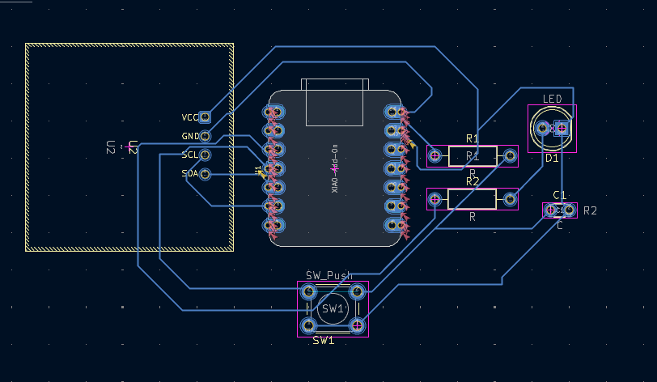
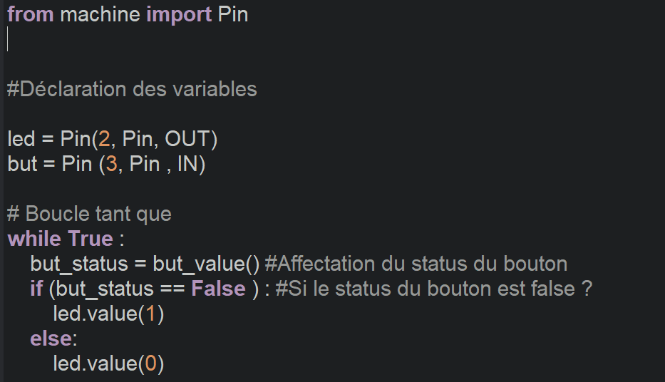

# JOURNAL — Mercredi 9 septembre 2026 - Rédigé par : **AMOUZOU Kodjo**

---

## Fait aujourd'hui

* Présence et appel.

### 1. Conception des PCB

* Suite de la conception des PCB à partir d'un schéma électronique.
* Importation des bibliothèques nécessaires pour les composants.
* Importation de la bibliothèque du **XIAO ESP32**.
* Création de bibliothèques personnalisées pour les composants ne disposant pas de bibliothèque adaptée.
* Création d'une bibliothèque pour un **écran OLED**.

-------------------

### 2. Conception et amélioration du boîtier

* Réalisation d'un nouveau boîtier en tenant compte des imperfections constatées sur le premier prototype.
* Redimensionnement du boîtier :

  * Longueur : **160 mm**.
  * Largeur : **110 mm**.
  * Hauteur : **35 mm**.
* Conception d'un **couvercle** adapté.
* Ajout d'un **support mural** permettant la fixation du boîtier.

### 3. Cours de programmation

* Introduction aux notions fondamentales de programmation.
* Étude des notions suivantes :

  * variables ;
  * boucles ;
  * fonctions ;
  * structures conditionnelles ;
  * commentaires ;
  * opérateurs arithmétiques ;
  * opérateurs logiques ;
  * opérateurs de comparaison ;
  * opérateur d'affectation.

### 4. Opérateurs étudiés

* **Opérateurs arithmétiques** :

  * addition `+` ;
  * soustraction `-` ;
  * multiplication `*` ;
  * modulo `%`.

* **Opérateurs logiques** :

  * `AND` ;
  * `OR` ;
  * `NOT`.

* **Opérateurs de comparaison** :

  * égalité ;
  * différence ;
  * supérieur ;
  * inférieur ;
  * supérieur ou égal ;
  * inférieur ou égal.

* **Opérateur d'affectation** :

  * permet d'attribuer une valeur à une variable.

### 5. Notions générales en informatique

* Définition des concepts fondamentaux :

  * ordinateur ;
  * informatique ;
  * programmation ;
  * langage de programmation.

* Découverte du **langage machine** et de son rôle dans l'exécution des instructions par l'ordinateur.

### 6. Première application pratique

* Mise en pratique des notions étudiées à travers un petit programme.
* Tentative de réalisation d'un programme permettant **d'allumer une LED**.
* Cette activité nous a permis de faire le lien entre la programmation et la commande d'un composant électronique réel.

---

## Appris

* Compréhension des différentes étapes de conception d'un PCB à partir d'un schéma électronique.
* Importation et utilisation de bibliothèques de composants.
* Création de bibliothèques personnalisées pour des composants spécifiques.
* Amélioration d'un modèle 3D à partir des défauts constatés sur un prototype.
* Importance du dimensionnement et de l'intégration des composants dans un boîtier.
* Découverte des principales notions de programmation.
* Utilisation des variables, boucles, fonctions et structures conditionnelles.
* Compréhension des différents types d'opérateurs.
* Compréhension du rôle des commentaires dans un programme.
* Découverte du langage machine.
* Mise en pratique de la programmation à travers la commande d'une LED.

---

## Raté, puis corrigé

| Difficulté rencontrée                                          | Cause / hypothèse                                                 | Correction apportée                                   | Résultat                                                 |
| -------------------------------------------------------------- | ----------------------------------------------------------------- | ----------------------------------------------------- | -------------------------------------------------------- |
| Bibliothèque du XIAO ESP32 non disponible                      | Le composant n'était pas présent dans les bibliothèques utilisées | Importation de la bibliothèque du XIAO                | Composant disponible pour la conception                  |
| Certains composants ne disposaient pas de bibliothèque adaptée | Bibliothèque inexistante ou non adaptée au composant              | Création de bibliothèques personnalisées              | Composants intégrables dans le PCB                       |
| Imperfections constatées sur le premier boîtier                | Dimensions et emplacements à améliorer                            | Nouvelle modélisation et redimensionnement du boîtier | Nouveau modèle de **160 × 110 × 35 mm**                  |
| Difficultés lors du premier programme LED                      | Découverte de la programmation et de la commande d'un composant   | Essais et corrections du programme                    | Meilleure compréhension du fonctionnement d'un programme |

---

## Décidé

* Continuer la conception des PCB à partir des schémas électroniques.
* Améliorer la maîtrise des bibliothèques de composants.
* Continuer à créer des bibliothèques personnalisées lorsque nécessaire.
* Poursuivre l'amélioration du boîtier et vérifier l'intégration des composants avant l'impression.
* Continuer l'apprentissage de la programmation.
* Pratiquer davantage les boucles, fonctions et structures conditionnelles.
* Réaliser d'autres programmes simples pour commander les composants électroniques.

---

## À faire demain

* Poursuivre la conception des PCB.
* Finaliser les bibliothèques nécessaires aux composants du projet.
* Continuer la modélisation et la préparation du nouveau boîtier.
* Tester le programme d'allumage de la LED.
* Approfondir les notions de programmation étudiées.
* Poursuivre les travaux sur le projet de groupe.
