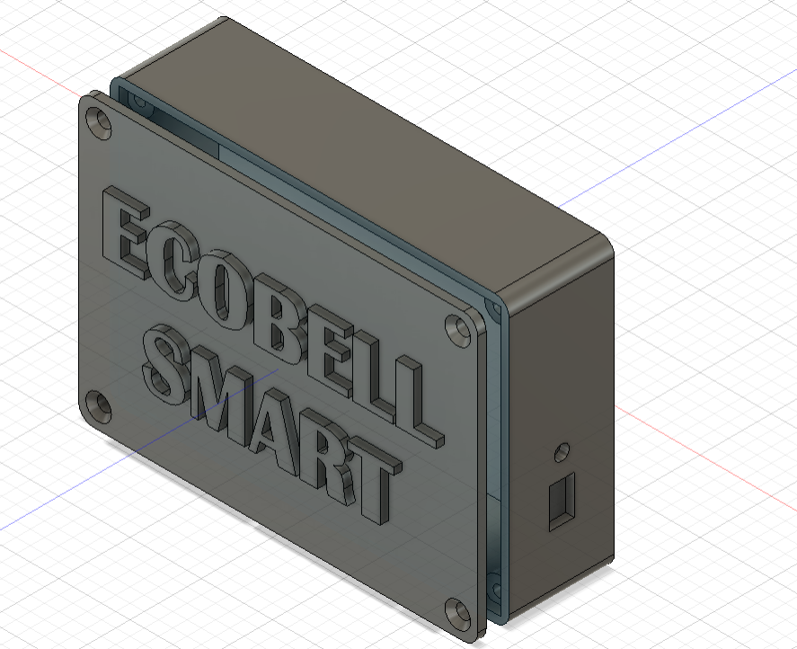
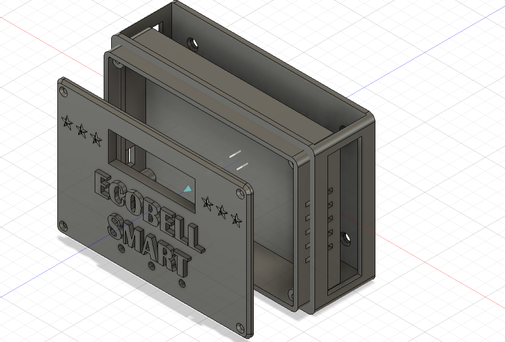

# JOURNAL — Jeudi 10 septembre 2026 - Rédigé par : **AMOUZOU Kodjo**

---

## Fait aujourd'hui

* Présence et appel.

### 1. Travail sur le projet P083

* Nous avons consacré la journée au travail sur notre projet de **sonnerie autonome à énergie solaire**.

* J'ai continué la **modélisation des boîtiers** destinés à contenir les différents composants du système.

**Image : Modélisation des boîtiers**

* Nous avons réalisé le **plan du montage** afin de mieux organiser les différents éléments du projet.

* Nous avons commencé à faire un **essai du montage** des différents composants.

* L'essai du montage n'a pas pu être mené à terme en raison du **manque de certains matériels**, notamment le **module RTC**.

* Nous avons fait le point sur les matériels disponibles et ceux qui sont encore nécessaires pour poursuivre les essais.

### 2. Répartition du travail

* Nous avons discuté de l'avancement de notre projet.

* Nous avons réparti le travail entre nous afin que chacun puisse avancer sur une partie du projet.

* J'ai pris en charge la poursuite de la **modélisation des boîtiers**.

* Cette répartition nous permettra de travailler sur les différentes parties du projet de manière organisée.

---

## Appris

* Importance de réaliser un plan avant de commencer le montage d'un système.

* Importance de vérifier la disponibilité de tous les composants avant de réaliser les essais.

* Rôle du **RTC** dans la gestion de l'heure du système de sonnerie.

* Importance de prendre en compte les dimensions réelles des composants lors de la modélisation d'un boîtier.

* Importance de bien répartir le travail pour faciliter l'avancement d'un projet de groupe.

* Les essais pratiques permettent d'identifier les composants manquants et les difficultés de montage.

---

## Raté, puis corrigé

| Difficulté rencontrée                                   | Cause / hypothèse                                                                      | Correction apportée                                               | Résultat                                      |
| ------------------------------------------------------- | -------------------------------------------------------------------------------------- | ----------------------------------------------------------------- | --------------------------------------------- |
| L'essai du montage n'a pas pu être terminé              | Manque de certains matériels, notamment le RTC                                         | Identifier les matériels manquants avant de poursuivre le montage | Montage en attente des composants nécessaires |
| Le montage n'a pas pu être testé complètement           | Certains composants nécessaires au fonctionnement du système n'étaient pas disponibles | Faire le point sur les composants disponibles et ceux à obtenir   | Les éléments manquants ont été identifiés     |
| Difficulté à organiser les différentes tâches du projet | Plusieurs parties du projet doivent être réalisées en parallèle                        | Répartition du travail entre nous                                 | Travail mieux organisé                        |

---

## Décidé

* Continuer la modélisation des boîtiers.

* Vérifier l'intégration des composants dans les boîtiers.

* Reprendre les essais du montage lorsque les matériels manquants seront disponibles.

* Respecter la répartition du travail définie dans le groupe.

* Continuer à faire avancer les différentes parties du projet en parallèle.

---

## À faire demain

* Poursuivre la modélisation des boîtiers.

* Continuer les tâches qui m'ont été attribuées dans le projet.

* Vérifier les dimensions et l'emplacement des composants dans le boîtier.

* Vérifier la disponibilité du **module RTC** et des autres matériels nécessaires.

* Reprendre progressivement les essais du montage.

* Poursuivre les travaux sur le projet P083.
