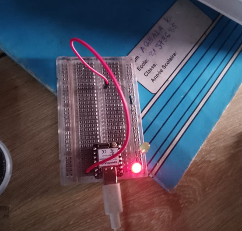

# JOURNAL — Vendredi 11 septembre 2026 - Rédigé par : **AMOUZOU Kodjo**

---

## Fait aujourd'hui

* Présence et appel.

### 1. Travail sur le projet P083

* Nous avons continué à travailler sur notre projet de **sonnerie autonome à énergie solaire**.

* J'ai poursuivi les **modifications sur la conception des boîtiers** afin d'améliorer leur adaptation aux différents composants du système.

* Après une longue attente, nous avons finalement reçu **tous les composants et matériels nécessaires** à la réalisation de notre projet.

* Cette réception nous a permis de pouvoir commencer certains essais pratiques avec le matériel réel.

### 2. Test du XIAO ESP32S3

* Nous avons réalisé un premier essai avec le **XIAO ESP32S3**.

* Nous avons essayé de connecter le XIAO ESP32S3 à son **réseau Wi-Fi**.

* Nous avons ensuite testé l'affichage d'une **page web** hébergée par l'ESP32S3.

* Ce test nous a permis de vérifier la possibilité d'utiliser l'ESP32S3 comme point d'accès et de communiquer avec une interface web.

**Image : Page web de test de l'ESP32S3**

### 3. Travail avec le mentor

* Nous avons travaillé avec notre **mentor** pour nous accompagner dans la réalisation des différents essais.

* Nous avons reçu des explications et des orientations concernant l'utilisation des composants et la programmation de l'ESP32S3.

### 4. Installation et initiation à Arduino

* Installation de l'**Arduino IDE** pour permettre la programmation de la carte.

* Initiation à l'utilisation de l'environnement Arduino.

* Découverte des principales étapes pour créer, compiler et téléverser un programme sur une carte ESP32.

* Installation du package **ESP32 by Espressif Systems** dans Arduino IDE afin de pouvoir programmer le XIAO ESP32S3.

### 5. Test d'allumage des LED

* Nous avons réalisé un premier test de commande d'une **LED** à partir du programme Arduino.

* Nous avons vérifié le câblage du circuit et le fonctionnement de la LED.

* Ce test nous a permis de faire le lien entre le programme et la commande d'un composant électronique réel.

**Image : Circuit de test des LED**

**Vidéo : Test d'allumage des LED**

---

## Appris

* Importance de modifier la conception d'un boîtier en fonction des composants réels disponibles.

* Importance de vérifier les dimensions et l'emplacement des composants avant la fabrication définitive du boîtier.

* Mise en pratique de la connexion d'un **XIAO ESP32S3** à un réseau Wi-Fi.

* Découverte de la création et de l'affichage d'une page web à partir de l'ESP32S3.

* Installation et utilisation de l'**Arduino IDE**.

* Installation du support **ESP32 by Espressif Systems** dans Arduino IDE.

* Initiation à la programmation et au téléversement d'un programme vers une carte ESP32.

* Compréhension du lien entre un programme et la commande d'un composant électronique réel.

* Mise en pratique de la commande d'une LED.

* Importance de l'accompagnement du mentor dans la réalisation et la correction des essais.

---

## Raté, puis corrigé

| Difficulté rencontrée                                                    | Cause / hypothèse                                                | Correction apportée                                             | Résultat                                                |
| ------------------------------------------------------------------------ | ---------------------------------------------------------------- | --------------------------------------------------------------- | ------------------------------------------------------- |
| Les boîtiers nécessitaient encore des modifications                      | La conception devait être mieux adaptée aux composants du projet | Modification et amélioration de la conception                   | Conception des boîtiers améliorée                       |
| Les essais pratiques étaient limités par le manque de matériel           | Certains composants n'étaient pas encore disponibles             | Réception de tous les composants et matériels nécessaires       | Les essais pratiques peuvent maintenant être poursuivis |
| Difficultés lors de la mise en place de l'environnement de programmation | Arduino IDE et le support ESP32 n'étaient pas encore installés   | Installation d'Arduino IDE et de **ESP32 by Espressif Systems** | Environnement prêt pour programmer l'ESP32S3            |
| Premier essai de commande d'une LED                                      | Découverte du fonctionnement de la programmation de l'ESP32S3    | Vérification du câblage et du programme avec le mentor          | LED testée et commandée avec succès                     |

---

## Décidé

* Continuer les modifications et l'amélioration des boîtiers.

* Poursuivre les essais avec les composants maintenant disponibles.

* Approfondir l'utilisation de l'Arduino IDE.

* Continuer la programmation du XIAO ESP32S3.

* Poursuivre les tests de communication Wi-Fi et de page web.

* Continuer les essais électroniques avec les différents composants du projet.

---

## À faire demain

* Poursuivre la conception et les modifications des boîtiers.-AMOUZOU Kodjo

* Continuer les tests du XIAO ESP32S3. - Groupe16

* Poursuivre la programmation avec Arduino IDE. - Groupe16

* Tester progressivement les différents composants du système. - Groupe 16

* Continuer les essais de câblage du projet. - Groupe 16

* Poursuivre le travail avec le mentor sur les parties nécessitant des corrections. - Groupe 16
