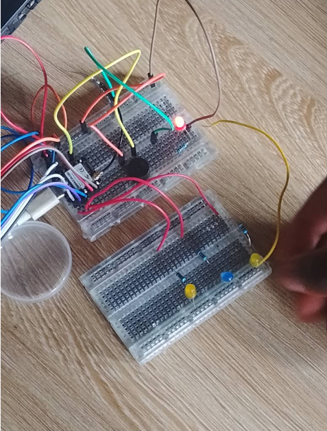
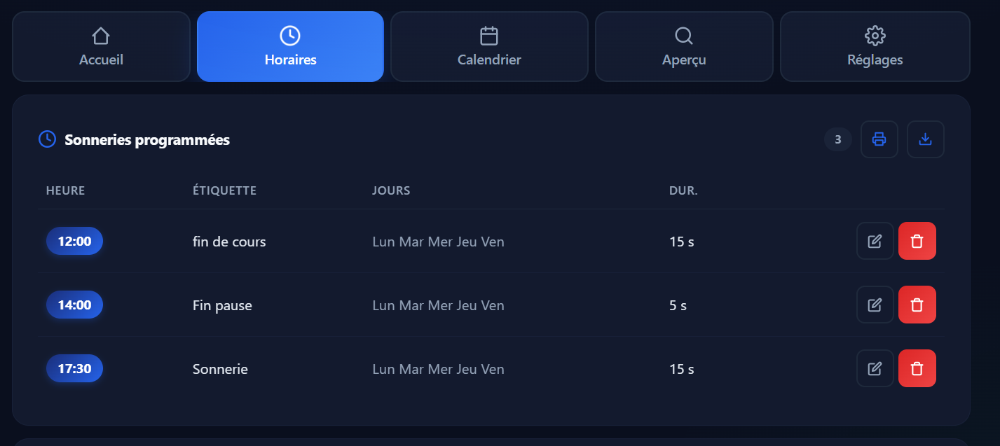
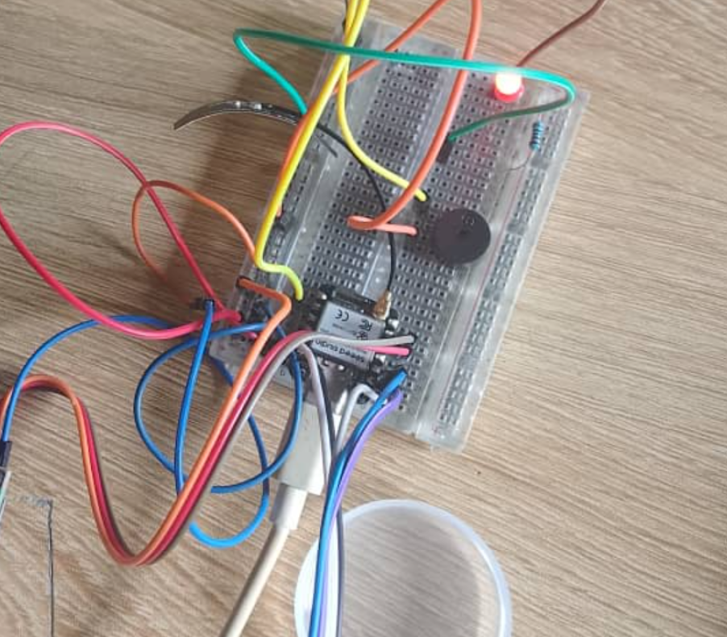

# JOURNAL — Samedi 12 septembre 2026 - Rédigé par : **AMOUZOU Kodjo**

---

## Fait aujourd'hui

### 1. Poursuite du projet

* Poursuite des travaux pratiques sur notre système de sonnerie scolaire automatique.
* Réalisation de plusieurs essais de câblage sur **breadboard**.
* Vérification des connexions entre les différents composants du système.

### 2. Câblage du système maître

* Réalisation du câblage du **XIAO ESP32-S3** avec :

  * le **RTC** ;
  * l'**écran LCD I2C** ;
  * les différents éléments nécessaires au fonctionnement du système maître.
* Vérification du fonctionnement des connexions après le câblage.

### 3. Programmation du RTC et du LCD

* Utilisation du langage **MicroPython** pour programmer le XIAO ESP32-S3.
* Mise en place de la communication avec le RTC.
* Réglage et synchronisation de l'heure du RTC.
* Affichage de l'heure sur l'écran LCD.
* Vérification de la correspondance entre l'heure enregistrée dans le RTC et celle affichée sur le LCD.

**[Photo à insérer : heure affichée sur le LCD]**

### 4. Développement du système maître

* J'ai principalement travaillé sur la **programmation du système maître**.
* Mise en place de la gestion des heures de sonnerie.
* Poursuite du développement jusqu'à obtenir un système maître capable de gérer les horaires.
* Mise en place de l'interface **web de gestion des heures**.
* Le site web permet de travailler sur la configuration et la gestion des horaires du système.

**Interface web de gestion des heures**

### 5. Test de la sonnerie

* Pour les premiers essais, nous avons utilisé un **buzzer à la place de la sirène**.
* Programmation du déclenchement du buzzer à partir du système maître.
* Vérification du fonctionnement de la sonnerie selon les commandes programmées.

### 6. Jeux de lumière

* Réalisation du câblage des **LED de jeux de lumière**.
* Programmation des différents effets lumineux.
* Synchronisation des jeux de lumière avec le déclenchement de la sonnerie.
* Vérification du fonctionnement des LED au moment où le buzzer sonne.

---

## Appris

* Approfondissement de la programmation d'un **XIAO ESP32-S3 avec MicroPython**.
* Compréhension de la communication entre le microcontrôleur, le RTC et le LCD.
* Apprentissage de la configuration et de la synchronisation de l'heure avec un RTC.
* Mise en pratique de la gestion des horaires à partir d'un programme.
* Découverte de l'intégration d'une **interface web locale** pour gérer les horaires.
* Mise en pratique de la commande d'un buzzer et des LED à partir du programme.
* Compréhension de la synchronisation entre la sonnerie et les jeux de lumière.

---

## Raté, puis corrigé

| Difficulté rencontrée                                                       | Cause / hypothèse                                                              | Correction apportée                                                   | Résultat                                            |
| --------------------------------------------------------------------------- | ------------------------------------------------------------------------------ | --------------------------------------------------------------------- | --------------------------------------------------- |
| Difficultés lors des premiers essais de câblage sur breadboard              | Certaines connexions devaient être vérifiées et corrigées                      | Vérification et correction progressive des branchements               | Câblage fonctionnel pour les essais                 |
| Problèmes lors de la communication entre le XIAO ESP32-S3, le RTC et le LCD | Configuration et programmation de la communication                             | Correction du programme MicroPython et vérification des connexions    | Heure correctement récupérée et affichée sur le LCD |
| Difficulté à synchroniser correctement l'heure du RTC                       | Réglage et programmation du RTC                                                | Mise en place du réglage de l'heure dans le programme MicroPython     | Heure synchronisée et affichée correctement         |
| Absence de la sirène pour les premiers essais                               | Nécessité de tester le système avant l'installation de la sirène               | Utilisation d'un buzzer comme élément de test                         | Déclenchement de la sonnerie réussi                 |
| Difficultés lors de la programmation des jeux de lumière                    | Mise en place de la commande et de la synchronisation des LED avec la sonnerie | Correction et amélioration du programme des LED                       | Jeux de lumière synchronisés avec la sonnerie       |
| Mise en place du système de gestion des horaires                            | Nécessité de relier la programmation, le RTC et l'interface de gestion         | Développement et tests du système maître ainsi que de l'interface web | Système maître capable de gérer les horaires        |

---

## Décision

* Continuer les essais du système maître avant l'intégration complète avec le système esclave.
* Poursuivre les tests de programmation et de communication entre les deux XIAO ESP32-S3.
* Conserver le buzzer comme élément de test avant l'installation de la sirène définitive.
* Continuer l'amélioration de l'interface web de gestion des horaires.

---

## À faire demain

* Poursuivre les tests du système maître.
* Vérifier davantage la gestion des différents horaires de sonnerie.
* Continuer les essais des jeux de lumière.
* Préparer la communication entre le système maître et le système esclave.
* Vérifier l'ensemble du câblage avant l'intégration dans le boîtier.

---

## Bilan

Cette séance nous a permis de faire une avancée importante dans notre projet. Nous avons réalisé les premiers câblages du **RTC, du LCD et du XIAO ESP32-S3**, puis programmé le système en **MicroPython** pour synchroniser et afficher l'heure. Nous avons également avancé sur le **système maître de gestion des horaires** avec la mise en place de l'interface web.

Les premiers tests de sonnerie ont été réalisés avec un **buzzer**, accompagnés de jeux de lumière programmés sur les LED. Le système maître commence ainsi à prendre sa forme définitive.
