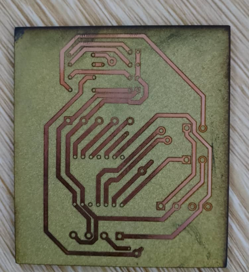
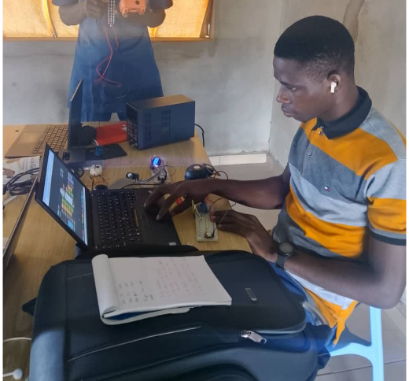

# JOURNAL — Lundi 14 septembre 2026 - **Rédigé par : AMOUZOU Kodjo**

---

## Fait aujourd'hui

### 1. Poursuite du projet

* Continuation des travaux pratiques sur notre système de sonnerie scolaire automatique.
* Poursuite des **câblages et de la programmation** des différents éléments.
* Vérification du fonctionnement des circuits réalisés.

### 2. Réalisation du PCB du système maître

* Réalisation du **PCB du système maître**.
* Mise en place des différents composants et connexions nécessaires au fonctionnement du système maître.
* Vérification du circuit avant les essais.
* Préparation du PCB pour son intégration dans le système final.

### 3. Réalisation du système esclave

* Finalisation du deuxième système basé sur le **XIAO ESP32-S3 esclave**.
* Réalisation et vérification de son câblage.
* Mise en place du programme destiné à commander la sonnerie.
* Préparation du système esclave pour les essais avec la sirène.

### 4. Test de la sirène

* Installation de la **sirène** sur le deuxième système.
* Réalisation d'un test réel de fonctionnement.
* Déclenchement de la sirène à partir du système esclave.
* Le test a été concluant : **la sirène a correctement fonctionné**.

### 5. Programmation et essais

* Poursuite de la programmation des deux systèmes.
* Vérification des commandes et des sorties.
* Correction de certains éléments du programme au cours des essais.
* Progression vers l'intégration du **système maître et du système esclave**.

---

## Appris

* Mise en pratique de la programmation de deux **XIAO ESP32-S3** avec des rôles différents.
* Approfondissement de la conception et de la réalisation d'un **PCB**.
* Compréhension de l'organisation des connexions du système maître sur un circuit imprimé.
* Apprentissage du raccordement et du test d'une sirène.
* Importance de vérifier le câblage et le programme avant chaque test.
* Meilleure compréhension de l'organisation d'un système composé d'un maître et d'un esclave.

---

## Raté, puis corrigé

| Difficulté rencontrée                                             | Cause / hypothèse                                                 | Correction apportée                                    | Résultat                                             |
| ----------------------------------------------------------------- | ----------------------------------------------------------------- | ------------------------------------------------------ | ---------------------------------------------------- |
| Difficultés lors de la poursuite des câblages                     | Certaines connexions devaient être vérifiées avant les essais     | Vérification et correction des branchements            | Câblage fonctionnel pour les tests                   |
| Difficultés lors de la réalisation du PCB du système maître       | Nécessité de vérifier les connexions et l'organisation du circuit | Vérification et correction du circuit avant les essais | PCB du système maître réalisé                        |
| Difficultés lors de la programmation du système esclave           | Mise en place du nouveau programme de commande                    | Modification et correction du programme MicroPython    | Système esclave opérationnel                         |
| Premier test de la sirène nécessitant des vérifications           | Câblage et commande de la sirène à contrôler                      | Vérification du câblage et du programme                | **Sirène fonctionnelle sur le système esclave**      |
| Nécessité de vérifier le fonctionnement du deuxième XIAO ESP32-S3 | Finalisation du système esclave                                   | Réalisation des essais pratiques                       | Deuxième système prêt pour la suite de l'intégration |

---

## Décision

* Poursuivre les tests du système maître et du système esclave.
* Continuer la programmation et la correction des éventuels problèmes.
* Vérifier la communication entre les deux XIAO ESP32-S3.
* Tester le déclenchement de la sirène à partir du système maître.
* Poursuivre l'intégration du PCB du système maître dans le boîtier.

---

## À faire demain

* Tester la communication entre le **système maître et le système esclave**.
* Vérifier le déclenchement de la sirène selon les horaires programmés.
* Poursuivre les essais des jeux de lumière.
* Vérifier l'ensemble des câblages.
* Continuer l'intégration du PCB et des composants dans les boîtiers.

---

## Bilan

La séance d'aujourd'hui a permis de réaliser une nouvelle étape importante de notre projet. Nous avons poursuivi les câblages et la programmation, puis nous avons **réalisé le PCB du système maître**.

Nous avons également finalisé le **système esclave basé sur le XIAO ESP32-S3** et effectué un test réel de la sirène. Le test a été concluant puisque **la sirène a correctement fonctionné**. Ces résultats nous rapprochent de l'intégration complète du système maître et du système esclave.
