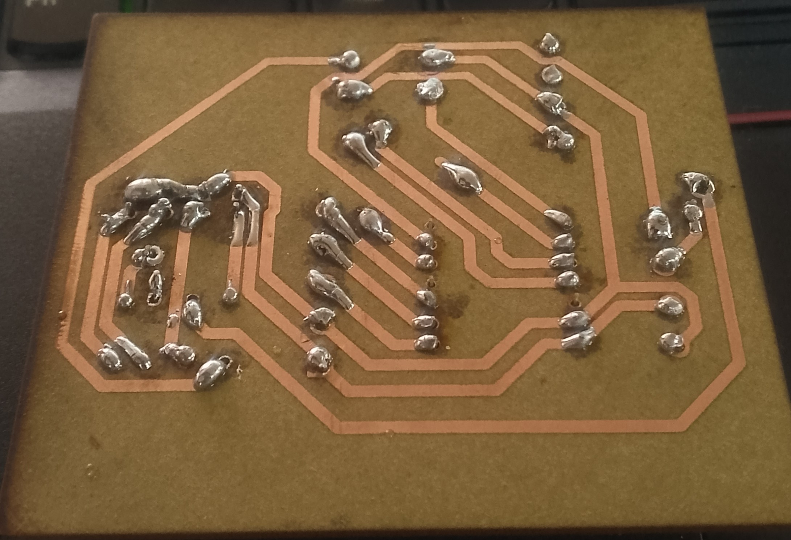
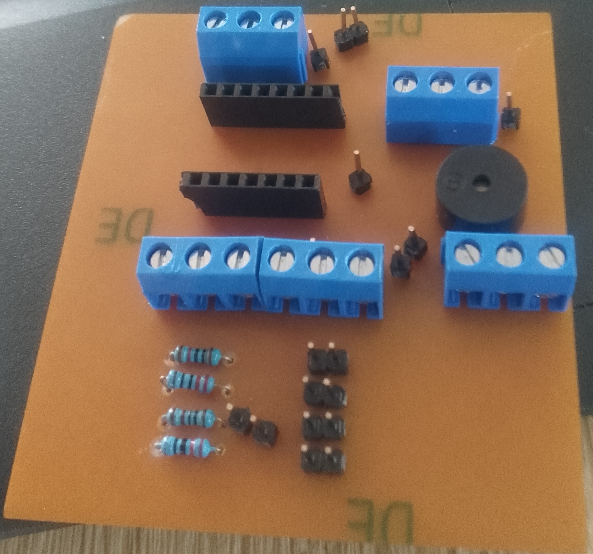

# JOURNAL — Mardi 15 septembre 2026 - Rédigé par : **AMOUZOU Kodjo**

---

## Fait aujourd'hui

### 1. Poursuite du projet

* Continuation des travaux pratiques sur notre système de sonnerie scolaire automatique.
* Poursuite de la réalisation des circuits électroniques des systèmes maître et esclave.
* Avancement de la conception mécanique des boîtiers.

### 2. Soudure du PCB du système maître

* Réalisation des **soudures sur le PCB du système maître**.
* Soudure des différents composants électroniques sur le circuit imprimé.
* Vérification des connexions et de la qualité des soudures.
* Préparation du PCB pour son intégration dans le boîtier.

### 3. Réalisation du PCB du système esclave

* Réalisation du **PCB du système esclave**.
* Mise en place des composants et des différentes connexions.
* Vérification de l'organisation du circuit avant les prochaines étapes.
* Préparation du PCB esclave pour la soudure et les essais.

### 4. Finalisation de la conception des boîtiers

* Finalisation de la **conception 3D des boîtiers** destinés aux systèmes maître et esclave.
* Vérification des dimensions et de l'emplacement des différents éléments.
* Vérification des ouvertures nécessaires pour les composants et les connexions.
* Finalisation de la conception des **couvercles et des supports muraux**.

### 5. Lancement des impressions 3D

* Lancement de l'**impression 3D des couvercles des boîtiers**.
* Lancement de l'impression des **supports muraux** destinés à la fixation des boîtiers.
* Vérification des paramètres d'impression avant le lancement.
* Préparation des pièces imprimées pour leur assemblage avec les boîtiers.

---

## Appris

* Mise en pratique de la **soudure des composants électroniques sur un PCB**.
* Importance de contrôler les soudures afin d'éviter les courts-circuits et les mauvaises connexions.
* Approfondissement de la réalisation d'un PCB pour un système électronique réel.
* Apprentissage des différentes étapes de finalisation d'un **boîtier conçu en 3D**.
* Compréhension de l'importance des dimensions et des ouvertures lors de la conception d'un boîtier électronique.
* Mise en pratique du lancement d'une **impression 3D de pièces destinées à un projet électronique**.
* Meilleure compréhension de l'intégration entre la partie électronique et la partie mécanique du projet.

---

## Raté, puis corrigé

| Difficulté rencontrée                          | Cause / hypothèse                                                                  | Correction apportée                            | Résultat                                              |
| ---------------------------------------------- | ---------------------------------------------------------------------------------- | ---------------------------------------------- | ----------------------------------------------------- |
| Vérification des soudures du PCB maître        | Certaines connexions devaient être contrôlées après la soudure                     | Contrôle visuel et vérification des connexions | PCB maître prêt pour la suite                         |
| Organisation des composants sur le PCB esclave | Nécessité de respecter les connexions prévues dans le circuit                      | Vérification du placement et des connexions    | PCB esclave réalisé                                   |
| Ajustements de la conception des boîtiers      | Nécessité d'adapter les pièces à l'intégration des composants                      | Finalisation des dimensions et des ouvertures  | Conception des boîtiers finalisée                     |
| Préparation des couvercles et supports muraux  | Nécessité d'avoir des pièces adaptées à la fixation et à la fermeture des boîtiers | Finalisation des modèles 3D                    | Pièces prêtes pour l'impression                       |
| Lancement des impressions 3D                   | Nécessité de vérifier les paramètres avant fabrication                             | Vérification et lancement des impressions      | Impression des couvercles et supports muraux en cours |

---

## Décision

* Poursuivre la réalisation et les essais des systèmes maître et esclave.
* Vérifier les PCB après les opérations de soudure.
* Continuer la programmation et les tests des deux XIAO ESP32-S3.
* Vérifier les pièces issues de l'impression 3D.
* Préparer l'intégration des PCB et des composants dans les boîtiers.
* Effectuer les premiers assemblages mécaniques dès que les pièces imprimées seront terminées.

---

## À faire demain

* Vérifier les **PCB maître et esclave** après les soudures.
* Poursuivre les tests électroniques des deux systèmes.
* Vérifier les pièces imprimées en 3D.
* Tester l'ajustement des couvercles sur les boîtiers.
* Vérifier la fixation des supports muraux.
* Commencer l'intégration des composants électroniques dans les boîtiers.
* Poursuivre les essais de communication entre le système maître et le système esclave.

---

## Bilan

La séance d'aujourd'hui a permis de faire avancer à la fois les parties **électronique et mécanique** de notre projet de sonnerie scolaire automatique.

Nous avons réalisé les **soudures sur le PCB du système maître**, puis poursuivi la réalisation du **PCB du système esclave**. Nous avons également finalisé la conception des boîtiers et lancé l'**impression 3D des couvercles et des supports muraux**.

Ces différentes étapes nous rapprochent de l'assemblage final du système, avec l'intégration des circuits électroniques dans les boîtiers et la réalisation d'un prototype complet.
